<h1 id="r2O97">mob1</h1>
<h2 id="mqGhE">java层分析</h2>
```java
package com.example.xxmobile01;

import android.os.Bundle;
import android.view.View;
import android.widget.Button;
import android.widget.EditText;
import android.widget.Toast;
import androidx.appcompat.app.AppCompatActivity;

/* loaded from: classes.dex */
public class MainActivity extends AppCompatActivity {
    private Button but1;
    private EditText ed1;

    public native String firstEncrypt(String str);

    public native String secondEncrypt(String str);

    static {
        System.loadLibrary("xxmobile01");
    }

    /* JADX INFO: Access modifiers changed from: protected */
    @Override // androidx.fragment.app.FragmentActivity, androidx.activity.ComponentActivity, androidx.core.app.ComponentActivity, android.app.Activity
    public void onCreate(Bundle bundle) {
        super.onCreate(bundle);
        setContentView(R.layout.activity_main);
        this.ed1 = (EditText) findViewById(R.id.flag);
        Button button = (Button) findViewById(R.id.check);
        this.but1 = button;
        button.setOnClickListener(new View.OnClickListener() { // from class: com.example.xxmobile01.MainActivity.1
            @Override // android.view.View.OnClickListener
            public void onClick(View view) {
                if (MainActivity.this.check(MainActivity.this.ed1.getText().toString())) {
                    Toast.makeText(MainActivity.this, "Success!", 0).show();
                } else {
                    Toast.makeText(MainActivity.this, "Wrong!", 0).show();
                }
            }
        });
    }

    /* JADX INFO: Access modifiers changed from: private */
    public boolean check(String str) {
        if (str.length() >= 13 && str.substring(0, 5).equals("ISCC{") && str.substring(str.length() - 1).equals("}")) {
            return Jformat(str.substring(5, str.length() - 1));
        }
        return false;
    }

    private boolean Jformat(String str) {
        try {
            return secondEncrypt(A.a(firstEncrypt(str))).equalsIgnoreCase("57898bb6079330d490ac35b2998d59c3");
        } catch (Exception unused) {
            return false;
        }
    }
}
```

```java
package com.example.xxmobile01;

/* loaded from: classes.dex */
public class A {
    public static String a(String str) {
        return str.replaceAll("\\s", "");
    }
}
```

java层代码少，主要在于check()，Jformat()，以及两个native方法

<h3 id="InKvt">check()方法</h3>
```java
    public boolean check(String str) {
        if (str.length() >= 13 && str.substring(0, 5).equals("ISCC{") && str.substring(str.length() - 1).equals("}")) {
            return Jformat(str.substring(5, str.length() - 1));
        }
        return false;
    }
```

if语句判断

长度>=13

以ISCC{ 开头

以 } 结尾

取出中间主体 inner = flag.sybstring(5,flag.length() - 1) 返回Jformat(inner)方法

<h3 id="zdMya">Jformat()方法</h3>
```java
    private boolean Jformat(String str) {
        try {
            return secondEncrypt(A.a(firstEncrypt(str))).equalsIgnoreCase("57898bb6079330d490ac35b2998d59c3");
        } catch (Exception unused) {
            return false;
        }
    }
```

firstEncrypt(str) native一次加工 --> A.a(...)删除所有空白字符( \\s ，含空格/制表符/换行等) --> secondEncrypt(...)  native二次加工  -->  结果与常量 "57898bb6079330d490ac35b2998d59c3" 做不区分大小写的对比

<h2 id="yaAum">so(native)层分析</h2>
<h3 id="om7m6">firstEncrypt</h3>
找到 Java_com_example_xxmobile01_MainActivity_firstEncrypt 函数

以及跳转 firstencrypt 函数

```c
__int64 __fastcall Java_com_example_xxmobile01_MainActivity_firstEncrypt(__int64 a1, __int64 a2, __int64 a3)
{
    __int64 v4; // r12
    _OWORD *ptr_1; // rbx
    void *src_1; // r13
    size_t n; // rbp
    _OWORD *v8; // rax
    __int64 v9; // r14
    void *ptr[2]; // [rsp+10h] [rbp-A8h] BYREF
    _OWORD *v12; // [rsp+20h] [rbp-98h]
    void *v13[2]; // [rsp+30h] [rbp-88h] BYREF
    char *v14; // [rsp+40h] [rbp-78h]
    void *v15[3]; // [rsp+50h] [rbp-68h] BYREF
    void *src; // [rsp+68h] [rbp-50h] BYREF
    _BYTE *src_2; // [rsp+70h] [rbp-48h]
    unsigned __int64 v18; // [rsp+80h] [rbp-38h]

    v18 = __readfsqword(0x28u);
    v4 = (*(__int64 (__fastcall **)(__int64, __int64, _QWORD))(*(_QWORD *)a1 + 1352LL))(a1, a3, 0);
    (*(void (__fastcall **)(__int64, __int64))(*(_QWORD *)a1 + 1344LL))(a1, a3);
    ptr_1 = (_OWORD *)operator new(0x10u);
    *ptr_1 = xmmword_42060;
    string_to_vector((const char *)&src, v4);
    *(_OWORD *)v13 = 0;
    v14 = 0;
    src_1 = src;
    n = src_2 - (_BYTE *)src;
    if ( src_2 != src )
    {
        if ( src_2 - (_BYTE *)src < 0 )
            sub_62090(v13);
        v13[0] = (void *)operator new(src_2 - (_BYTE *)src);
        v14 = (char *)v13[0] + n;
        memcpy(v13[0], src_1, n);
        v13[1] = (char *)v13[0] + n;
    }
    *(_OWORD *)ptr = 0;
    v8 = (_OWORD *)operator new(0x10u);
    ptr[0] = v8;
    v12 = v8 + 1;
    *v8 = *ptr_1;
    ptr[1] = v8 + 1;
    firstencrypt(v15, v13, ptr);
    if ( ptr[0] )
    {
        ptr[1] = ptr[0];
        operator delete(ptr[0]);
    }
    if ( v13[0] )
    {
        v13[1] = v13[0];
        operator delete(v13[0]);
    }
    (*(void (__fastcall **)(__int64, __int64, __int64))(*(_QWORD *)a1 + 1360LL))(a1, a3, v4);
    v9 = vector_to_hex_string(a1, v15);
    if ( v15[0] )
        operator delete(v15[0]);
    if ( src )
    {
        src_2 = src;
        operator delete(src);
    }
    operator delete(ptr_1);
    return v9;
}
```

```c
int **__fastcall firstencrypt(int **a1, int **a2, __int64 *a3)
{
  int *v3; // rcx
  int *v4; // rax
  __int64 v5; // r9
  unsigned __int64 n3; // r10
  unsigned __int64 v8; // r10
  unsigned int v9; // r11d
  unsigned int v10; // eax
  int i_1; // r10d
  unsigned int v12; // edx
  unsigned int v13; // ebp
  unsigned int v14; // ebx
  int v15; // ebp
  __int64 i; // r14
  unsigned int v17; // r15d
  int *v19; // [rsp+0h] [rbp-48h]
  int v20; // [rsp+Ch] [rbp-3Ch] BYREF
  unsigned __int64 v21; // [rsp+10h] [rbp-38h]

  v21 = __readfsqword(0x28u);
  v3 = *a2;
  v4 = a2[1];
  if ( *a2 == v4 )
  {
    *a1 = v3;
    a1[1] = v3;
    a1[2] = a2[2];
    *(_OWORD *)a2 = 0;
    a2[2] = 0;
  }
  else
  {
    v5 = *a3;
    n3 = (a3[1] - *a3) >> 2;
    if ( n3 <= 3 )
    {
      v20 = 0;
      sub_61DD0(a3, 4 - n3, &v20);
      v3 = *a2;
      v4 = a2[1];
      v5 = *a3;
    }
    v19 = v4;
    v8 = (unsigned __int64)((char *)v4 - (char *)v3) >> 2;
    v9 = 0;
    v10 = 0x34 / (unsigned int)v8 + 6;
    i_1 = v8 - 1;
    v12 = v3[i_1];
    do
    {
      v9 -= 1640531527;
      v14 = v9 >> 2;
      if ( i_1 )
      {
        v15 = *v3;
        for ( i = 0; i != i_1; ++i )
        {
          v17 = v3[i + 1];
          v12 = v15
              + ((((v12 >> 5) ^ (4 * v17)) + ((v17 >> 3) ^ (16 * v12)))
               ^ ((v9 ^ v17) + (*(_DWORD *)(v5 + 4LL * (((unsigned __int8)i ^ (unsigned __int8)v14) & 3)) ^ v12)));
          v3[i] = v12;
          v15 = v17;
        }
        v13 = v3[i_1];
      }
      else
      {
        v13 = v12;
      }
      v12 = v13
          + ((((v12 >> 5) ^ (4 * *v3)) + (((unsigned int)*v3 >> 3) ^ (16 * v12)))
           ^ ((v9 ^ *v3) + (*(_DWORD *)(v5 + 4LL * (((unsigned __int8)i_1 ^ (unsigned __int8)v14) & 3)) ^ v12)));
      v3[i_1] = v12;
      --v10;
    }
    while ( v10 );
    *a1 = v3;
    a1[1] = v19;
    a1[2] = a2[2];
    *(_OWORD *)a2 = 0;
    a2[2] = 0;
  }
  return a1;
}
```

可变长度分组以及轮次，确定是xxtea加密

 Java_com_example_xxmobile01_MainActivity_firstEncrypt  JNI封装函数，取java字符串，然后调用firstencrypto函数，实现 'XXTEA' 加密，然后把结果转成十六进制字符串返回

密钥key在内置常量xmmword_42060

```c
.rodata:0000000000042060 78 56 34 12                       dword_42060 dd 12345678h                ; DATA XREF: Java_com_example_xxmobile01_MainActivity_firstEncrypt+57↓r
.rodata:0000000000042064 F0 DE BC 9A                       dd 9ABCDEF0h
.rodata:0000000000042068 A9 CB ED 0F                       dd 0FEDCBA9h
.rodata:000000000004206C 21 43 65 87                       dd 87654321h
```

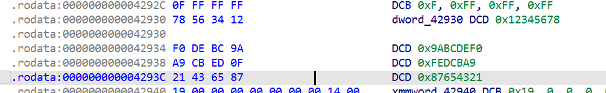

<h3 id="uqVal">secondEncrypt</h3>
这里名字检索有一个陷阱

```c
void __noreturn Java_com_example_xxmobile01_MainActivity_secondEncrypt()
{
  sub_62C00("basic_string");
}
```

```c
void __fastcall __noreturn sub_62C00(__int64 a1)
{
  exception *exception; // rbx

  exception = (exception *)__cxa_allocate_exception(0x10u);
  sub_62C50(exception, a1);
  __cxa_throw(
    exception,
    (struct type_info *)&`typeinfo for'std::out_of_range,
    (void (*)(void *))std::out_of_range::~out_of_range);
}
```

```c
void (__fastcall **__fastcall sub_62C50(exception *exception, const char *a2))(std::out_of_range *__hidden this)
{
  std::logic_error::logic_error((std::logic_error *)exception, a2);
  *(_QWORD *)&exception->type = off_D08F0;
  return off_D08F0;
}
```

直接抛出异常了

这里看一下 JNI_OnLoad

```c
__int64 __fastcall JNI_OnLoad(__int64 a1)
{
  int v1; // ecx
  __int64 result; // rax
  __int64 v3; // rsi
  _QWORD v4[2]; // [rsp+8h] [rbp-10h] BYREF

  v4[1] = __readfsqword(0x28u);
  v1 = (*(__int64 (__fastcall **)(__int64, _QWORD *, __int64))(*(_QWORD *)a1 + 48LL))(a1, v4, 65542);
  result = 0xFFFFFFFFLL;
  if ( !v1 )
  {
    v3 = (*(__int64 (__fastcall **)(_QWORD, const char *))(*(_QWORD *)v4[0] + 48LL))(
           v4[0],
           "com/example/xxmobile01/MainActivity");
    result = 0xFFFFFFFFLL;
    if ( v3 )
      return ((*(int (__fastcall **)(_QWORD, __int64, char **, __int64))(*(_QWORD *)v4[0]
                                                                       + 1720LL))(
                v4[0],
                v3,
                off_D6270,                      // "secondEncrypt"
                1) >> 31)
           | 0x10006u;
  }
  return result;
}
```

```c
.data:00000000000D6270                                                                           ; "secondEncrypt"
.data:00000000000D6278 A2 23 04 00 00 00 00 00           dq offset aLjavaLangStrin               ; "(Ljava/lang/String;)Ljava/lang/String;"
.data:00000000000D6280 80 29 06 00 00 00 00 00           dq offset _Z10sub_032479P7_JNIEnvP8_jobjectP8_jstring ; sub_032479(_JNIEnv *,_jobject *,_jstring *)
```

```c
__int64 __fastcall sub_032479(__int64 a1, __int64 a2, __int64 a3)
{
  const char *s; // rax
  __int64 v5; // rdx
  const char *src; // r15
  size_t n0x17; // rax
  size_t n; // r12
  char *dest_1; // r13
  __int64 v11; // rbp
  char *ptr_1; // rsi
  __int64 v13; // rbx
  unsigned int v14[4]; // [rsp+0h] [rbp-78h] BYREF
  void *ptr; // [rsp+10h] [rbp-68h]
  _QWORD dest[2]; // [rsp+18h] [rbp-60h] BYREF
  void *ptr_2; // [rsp+28h] [rbp-50h]
  unsigned int v18[4]; // [rsp+30h] [rbp-48h] BYREF
  unsigned __int64 v19; // [rsp+40h] [rbp-38h]

  v19 = __readfsqword(0x28u);
  s = (const char *)(*(__int64 (__fastcall **)(__int64, __int64, _QWORD))(*(_QWORD *)a1 + 1352LL))(a1, a3, 0);
  if ( !s )
    return (*(__int64 (__fastcall **)(__int64, const char *, __int64, unsigned __int64))(*(_QWORD *)a1 + 1336LL))(
             a1,
             "ERROR: Failed to get input string",
             v5,
             __readfsqword(0x28u));
  src = s;
  n0x17 = strlen(s);
  if ( n0x17 >= 0xFFFFFFFFFFFFFFF0LL )
    sub_62C70(dest);
  n = n0x17;
  if ( n0x17 >= 0x17 )
  {
    v11 = n0x17 | 0xF;
    dest_1 = (char *)operator new((n0x17 | 0xF) + 1);
    ptr_2 = dest_1;
    dest[0] = v11 + 2;
    dest[1] = n;
  }
  else
  {
    LOBYTE(dest[0]) = 2 * n0x17;
    dest_1 = (char *)dest + 1;
    if ( !n0x17 )
      goto LABEL_9;
  }
  memmove(dest_1, src, n);
LABEL_9:
  dest_1[n] = 0;
  hex_string_to_uint32(dest, v18);
  encrypt_block(v18, 0x89ABCDEF);
  uint32_to_hex_string(v14);
  (*(void (__fastcall **)(__int64, __int64, const char *))(*(_QWORD *)a1 + 1360LL))(a1, a3, src);
  if ( (v14[0] & 1) != 0 )
    ptr_1 = (char *)ptr;
  else
    ptr_1 = (char *)v14 + 1;
  v13 = (*(__int64 (__fastcall **)(__int64, char *))(*(_QWORD *)a1 + 1336LL))(a1, ptr_1);
  if ( (v14[0] & 1) != 0 )
    operator delete(ptr);
  if ( (dest[0] & 1) != 0 )
    operator delete(ptr_2);
  return v13;
}
```

<h4 id="thsq1">encrypt_block</h4>
```c
__int64 __fastcall encrypt_block(unsigned int *a1, int a2)
{
  unsigned int v3; // edx
  unsigned int v4; // edi
  int v5; // r13d
  int v6; // ecx
  char n8_1; // si
  __int64 n8; // r11
  unsigned int v9; // ebx
  unsigned int v10; // eax
  int v11; // ebp
  int v12; // eax
  int v13; // r14d
  int v14; // r9d
  int v15; // eax
  int v16; // ebp
  int v17; // r9d
  int v18; // ebp
  int v19; // esi
  unsigned int v20; // ecx
  unsigned int v21; // ecx
  __int64 result; // rax
  unsigned int v23; // [rsp+4h] [rbp-68h]
  unsigned int *v25; // [rsp+1Ch] [rbp-50h]

  v3 = *a1;
  v4 = a1[1];
  v5 = 0;
  v6 = 0;
  n8_1 = 0;
  n8 = 0;
  v9 = a1[2];
  v25 = a1;
  v23 = a1[3];
  do
  {
    v10 = __ROL4__(a2, v6);
    v11 = v5
        ^ ((byte_43D00[(unsigned __int8)v10] + (byte_43D00[BYTE1(v10)] << 8))
         | (byte_43D00[BYTE2(v10)] << 16)
         | (byte_43D00[HIBYTE(v10)] << 24));
    v12 = (byte_43D00[(unsigned __int8)v4]
         | (byte_43D00[BYTE1(v4)] << 8)
         | (byte_43D00[BYTE2(v4)] << 16)
         | (byte_43D00[HIBYTE(v4)] << 24))
        ^ __ROL4__(v11, 5);
    ++n8;
    v13 = v12
        ^ __ROL4__(
            v11
          ^ (byte_43D00[(unsigned __int8)v3]
           | (byte_43D00[BYTE1(v3)] << 8)
           | (byte_43D00[BYTE2(v3)] << 16)
           | (byte_43D00[HIBYTE(v3)] << 24)),
            n8_1);
    v14 = (byte_43D00[(unsigned __int8)v9]
         | (byte_43D00[BYTE1(v9)] << 8)
         | (byte_43D00[BYTE2(v9)] << 16)
         | (byte_43D00[HIBYTE(v9)] << 24))
        ^ __ROL4__(v11, 10);
    v15 = v14 ^ __ROL4__(v12, n8);
    v16 = (byte_43D00[(unsigned __int8)v23]
         | (byte_43D00[BYTE1(v23)] << 8)
         | (byte_43D00[BYTE2(v23)] << 16)
         | (byte_43D00[HIBYTE(v23)] << 24))
        ^ __ROL4__(v11, 15);
    v17 = v16 ^ __ROL4__(v14, n8_1 + 2);
    v18 = v13 ^ __ROL4__(v16, n8_1 + 3);
    v3 = v15 ^ __ROL4__(v17, 7) ^ __ROL4__(v18, 21);
    v19 = v13 ^ __ROL4__(v15, 3) ^ __ROL4__(v17, 27);
    v4 = __ROL4__(v19, 15) ^ v17 ^ __ROL4__(v18, 13);
    v23 = v19;
    v9 = v18 ^ __ROL4__(v19, 19) ^ __ROL4__(v3, 9);
    v6 += 3;
    v5 -= 1640531527;
    n8_1 = n8;
  }
  while ( n8 != 8 );
  v20 = __ROL4__(a2, 24);
  v21 = (byte_43D00[(unsigned __int8)v20]
       | (byte_43D00[BYTE1(v20)] << 8)
       | (byte_43D00[BYTE2(v20)] << 16)
       | (byte_43D00[HIBYTE(v20)] << 24))
      ^ 0xF1BBCDC8;
  *v25 = v21 ^ v3;
  v25[1] = __ROL4__(v21, 25) ^ v4;
  v25[2] = __ROL4__(v21, 18) ^ v9;
  result = __ROL4__(v21, 11) ^ v23;
  v25[3] = result;
  return result;
}
```

魔改的AES

S盒：

```c
.rodata:0000000000043D00                                   ; unsigned __int8 byte_43D00[256]
.rodata:0000000000043D00 63 7C 77 7B F2 6B 6F C5 30 01     byte_43D00 db 63h, 7Ch, 77h, 7Bh, 0F2h, 6Bh, 6Fh, 0C5h, 30h, 1, 67h, 2Bh, 0FEh, 0D7h
.rodata:0000000000043D00 67 2B FE D7                                                               ; DATA XREF: sub_bytes(uint)+5↓o
.rodata:0000000000043D00                                                                           ; key_expansion(uint,uint)+A↓o
.rodata:0000000000043D00                                                                           ; encrypt_block(uint *,uint)+1A↓o
.rodata:0000000000043D0E AB 76 CA 82 C9 7D FA 59 47 F0…    db 0ABh, 76h, 0CAh, 82h, 0C9h, 7Dh, 0FAh, 59h, 47h, 0F0h, 0ADh, 0D4h, 0A2h
.rodata:0000000000043D1B AF 9C A4 72 C0 B7 FD 93 26 36…    db 0AFh, 9Ch, 0A4h, 72h, 0C0h, 0B7h, 0FDh, 93h, 26h, 36h, 3Fh, 0F7h, 0CCh
.rodata:0000000000043D28 34 A5 E5 F1 71 D8 31 15 04 C7…    db 34h, 0A5h, 0E5h, 0F1h, 71h, 0D8h, 31h, 15h, 4, 0C7h, 23h, 0C3h, 18h
.rodata:0000000000043D35 96 05 9A 07 12 80 E2 EB 27 B2…    db 96h, 5, 9Ah, 7, 12h, 80h, 0E2h, 0EBh, 27h, 0B2h, 75h, 9, 83h, 2Ch, 1Ah
.rodata:0000000000043D44 1B 6E 5A A0 52 3B D6 B3 29 E3…    db 1Bh, 6Eh, 5Ah, 0A0h, 52h, 3Bh, 0D6h, 0B3h, 29h, 0E3h, 2Fh, 84h, 53h
.rodata:0000000000043D51 D1 00 ED 20 FC B1 5B 6A CB BE…    db 0D1h, 0, 0EDh, 20h, 0FCh, 0B1h, 5Bh, 6Ah, 0CBh, 0BEh, 39h, 4Ah, 4Ch
.rodata:0000000000043D5E 58 CF D0 EF AA FB 43 4D 33 85…    db 58h, 0CFh, 0D0h, 0EFh, 0AAh, 0FBh, 43h, 4Dh, 33h, 85h, 45h, 0F9h, 2
.rodata:0000000000043D6B 7F 50 3C 9F A8 51 A3 40 8F 92…    db 7Fh, 50h, 3Ch, 9Fh, 0A8h, 51h, 0A3h, 40h, 8Fh, 92h, 9Dh, 38h, 0F5h
.rodata:0000000000043D78 BC B6 DA 21 10 FF F3 D2 CD 0C…    db 0BCh, 0B6h, 0DAh, 21h, 10h, 0FFh, 0F3h, 0D2h, 0CDh, 0Ch, 13h, 0ECh
.rodata:0000000000043D84 5F 97 44 17 C4 A7 7E 3D 64 5D…    db 5Fh, 97h, 44h, 17h, 0C4h, 0A7h, 7Eh, 3Dh, 64h, 5Dh, 19h, 73h, 60h, 81h
.rodata:0000000000043D92 4F DC 22 2A 90 88 46 EE B8 14…    db 4Fh, 0DCh, 22h, 2Ah, 90h, 88h, 46h, 0EEh, 0B8h, 14h, 0DEh, 5Eh, 0Bh
.rodata:0000000000043D9F DB E0 32 3A 0A 49 06 24 5C C2…    db 0DBh, 0E0h, 32h, 3Ah, 0Ah, 49h, 6, 24h, 5Ch, 0C2h, 0D3h, 0ACh, 62h
.rodata:0000000000043DAC 91 95 E4 79 E7 C8 37 6D 8D D5…    db 91h, 95h, 0E4h, 79h, 0E7h, 0C8h, 37h, 6Dh, 8Dh, 0D5h, 4Eh, 0A9h, 6Ch
.rodata:0000000000043DB9 56 F4 EA 65 7A AE 08 BA 78 25…    db 56h, 0F4h, 0EAh, 65h, 7Ah, 0AEh, 8, 0BAh, 78h, 25h, 2Eh, 1Ch, 0A6h
.rodata:0000000000043DC6 B4 C6 E8 DD 74 1F 4B BD 8B 8A…    db 0B4h, 0C6h, 0E8h, 0DDh, 74h, 1Fh, 4Bh, 0BDh, 8Bh, 8Ah, 70h, 3Eh, 0B5h
.rodata:0000000000043DD3 66 48 03 F6 0E 61 35 57 B9 86…    db 66h, 48h, 3, 0F6h, 0Eh, 61h, 35h, 57h, 0B9h, 86h, 0C1h, 1Dh, 9Eh, 0E1h
.rodata:0000000000043DE1 F8 98 11 69 D9 8E 94 9B 1E 87…    db 0F8h, 98h, 11h, 69h, 0D9h, 8Eh, 94h, 9Bh, 1Eh, 87h, 0E9h, 0CEh, 55h
.rodata:0000000000043DEE 28 DF 8C A1 89 0D BF E6 42 68…    db 28h, 0DFh, 8Ch, 0A1h, 89h, 0Dh, 0BFh, 0E6h, 42h, 68h, 41h, 99h, 2Dh
.rodata:0000000000043DFB 0F B0 54 BB 16                    db 0Fh, 0B0h, 54h, 0BBh, 16h
```

<h2 id="qmpeP">exp:</h2>
```c
#!/usr/bin/env python3
# -*- coding: utf-8 -*-

from typing import List

TARGET = "57898bb6079330d490ac35b2998d59c3"  # Jformat 里的目标 32-hex

# ========= AES S-Box（与 .rodata:byte_43D00 完全一致）=========
SBOX = bytes([
    0x63,0x7c,0x77,0x7b,0xf2,0x6b,0x6f,0xc5,0x30,0x01,0x67,0x2b,0xfe,0xd7,0xab,0x76,
    0xca,0x82,0xc9,0x7d,0xfa,0x59,0x47,0xf0,0xad,0xd4,0xa2,0xaf,0x9c,0xa4,0x72,0xc0,
    0xb7,0xfd,0x93,0x26,0x36,0x3f,0xf7,0xcc,0x34,0xa5,0xe5,0xf1,0x71,0xd8,0x31,0x15,
    0x04,0xc7,0x23,0xc3,0x18,0x96,0x05,0x9a,0x07,0x12,0x80,0xe2,0xeb,0x27,0xb2,0x75,
    0x09,0x83,0x2c,0x1a,0x1b,0x6e,0x5a,0xa0,0x52,0x3b,0xd6,0xb3,0x29,0xe3,0x2f,0x84,
    0x53,0xd1,0x00,0xed,0x20,0xfc,0xb1,0x5b,0x6a,0xcb,0xbe,0x39,0x4a,0x4c,0x58,0xcf,
    0xd0,0xef,0xaa,0xfb,0x43,0x4d,0x33,0x85,0x45,0xf9,0x02,0x7f,0x50,0x3c,0x9f,0xa8,
    0x51,0xa3,0x40,0x8f,0x92,0x9d,0x38,0xf5,0xbc,0xb6,0xda,0x21,0x10,0xff,0xf3,0xd2,
    0xcd,0x0c,0x13,0xec,0x5f,0x97,0x44,0x17,0xc4,0xa7,0x7e,0x3d,0x64,0x5d,0x19,0x73,
    0x60,0x81,0x4f,0xdc,0x22,0x2a,0x90,0x88,0x46,0xee,0xb8,0x14,0xde,0x5e,0x0b,0xdb,
    0xe0,0x32,0x3a,0x0a,0x49,0x06,0x24,0x5c,0xc2,0xd3,0xac,0x62,0x91,0x95,0xe4,0x79,
    0xe7,0xc8,0x37,0x6d,0x8d,0xd5,0x4e,0xa9,0x6c,0x56,0xf4,0xea,0x65,0x7a,0xae,0x08,
    0xba,0x78,0x25,0x2e,0x1c,0xa6,0xb4,0xc6,0xe8,0xdd,0x74,0x1f,0x4b,0xbd,0x8b,0x8a,
    0x70,0x3e,0xb5,0x66,0x48,0x03,0xf6,0x0e,0x61,0x35,0x57,0xb9,0x86,0xc1,0x1d,0x9e,
    0xe1,0xf8,0x98,0x11,0x69,0xd9,0x8e,0x94,0x9b,0x1e,0x87,0xe9,0xce,0x55,0x28,0xdf,
    0x8c,0xa1,0x89,0x0d,0xbf,0xe6,0x42,0x68,0x41,0x99,0x2d,0x0f,0xb0,0x54,0xbb,0x16
])

# 逆 S-Box
INV_S = [0]*256
for i, b in enumerate(SBOX):
    INV_S[b] = i
INV_S = bytes(INV_S)

def rol32(x: int, r: int) -> int:
    x &= 0xFFFFFFFF
    r &= 31
    return ((x << r) | (x >> (32 - r))) & 0xFFFFFFFF

def ror32(x: int, r: int) -> int:
    x &= 0xFFFFFFFF
    r &= 31
    return ((x >> r) | (x << (32 - r))) & 0xFFFFFFFF

def S32(x: int) -> int:
    return ((SBOX[(x      ) & 0xFF]      ) |
            (SBOX[(x >>  8) & 0xFF] <<  8) |
            (SBOX[(x >> 16) & 0xFF] << 16) |
            (SBOX[(x >> 24) & 0xFF] << 24)) & 0xFFFFFFFF

def S32_INV(y: int) -> int:
    return ((INV_S[(y      ) & 0xFF]      ) |
            (INV_S[(y >>  8) & 0xFF] <<  8) |
            (INV_S[(y >> 16) & 0xFF] << 16) |
            (INV_S[(y >> 24) & 0xFF] << 24)) & 0xFFFFFFFF

# ========= secondEncrypt 的解密 =========
def hex_to_u32x4(s: str) -> List[int]:
    if len(s) != 32:
        raise ValueError("Invalid hex string length")
    return [int(s[i*8:(i+1)*8], 16) for i in range(4)]

def u32x4_to_hex(v: List[int]) -> str:
    return ''.join(f'{x & 0xFFFFFFFF:08x}' for x in v)

def second_decrypt_hex(hex_out: str, key: int = 0x89ABCDEF) -> str:
    """ 解密 secondEncrypt：32-hex 输出 -> 32-hex 输入（即 firstEncrypt 的输出） """
    w0, w1, w2, w3 = hex_to_u32x4(hex_out)

    # 逆 whitening
    t  = (S32(rol32(key, 24)) ^ 0xF1BBCDC8) & 0xFFFFFFFF
    v3 = (w0 ^ t)                  & 0xFFFFFFFF
    v4 = (w1 ^ rol32(t, 25))       & 0xFFFFFFFF
    v9 = (w2 ^ rol32(t, 18))       & 0xFFFFFFFF
    v23= (w3 ^ rol32(t, 11))       & 0xFFFFFFFF

    # 8 -> 1 轮反推
    # 轮内只依赖 key 与计数（v5, v6），跟状态无关，按加密的生成式倒算即可
    v6 = (3 * 8) % 32      # 轮8结束时加过 8 次，每轮 +3：进入轮8前 v6=21，本轮用21，结束后=24；我们用每轮时的值
    v5 = ((-0x61C88647 * 8) & 0xFFFFFFFF)  # 进入轮9前的 v5；但我们每轮计算用的是“本轮开始时的 v5”，所以先在回滚前加回 delta
    for n in range(8, 0, -1):
        # 回滚 v6,v5 到本轮开始值
        v6 = (v6 - 3) & 0xFFFFFFFF       # 本轮开始时的 v6
        v5 = (v5 + 0x61C88647) & 0xFFFFFFFF  # 本轮开始时的 v5

        v19_new = v23
        v18 = (v9 ^ rol32(v19_new, 19) ^ rol32(v3, 9)) & 0xFFFFFFFF
        v17 = (v4 ^ rol32(v19_new, 15) ^ rol32(v18, 13)) & 0xFFFFFFFF
        tempA = (v3 ^ rol32(v18, 21)) & 0xFFFFFFFF  # = v15 ^ ROL(v17,7)
        v15 = (tempA ^ rol32(v17, 7)) & 0xFFFFFFFF
        tempB = (v19_new ^ rol32(v17, 27)) & 0xFFFFFFFF  # = v13 ^ ROL(v15,3)
        v13 = (tempB ^ rol32(v15, 3)) & 0xFFFFFFFF

        # 反推出 v16, v14, v12
        v16 = ror32((v13 ^ v18) & 0xFFFFFFFF, (n - 1) + 3)   # 因为 v18 = v13 ^ ROL(v16, n-1+3)
        v14 = ror32((v17 ^ v16) & 0xFFFFFFFF, (n - 1) + 2)   # 因为 v17 = v16 ^ ROL(v14, n-1+2)
        v12 = ror32((v15 ^ v14) & 0xFFFFFFFF, n)             # 因为 v15 = v14 ^ ROL(v12, n)

        # 本轮的 v11 只依赖 key 与计数
        tkey = rol32(key, v6)
        v11  = (v5 ^ S32(tkey)) & 0xFFFFFFFF

        # 解 S 盒，恢复上一轮的 v3,v4,v9,v23
        sv4  = (v12 ^ rol32(v11, 5)) & 0xFFFFFFFF
        sv3  = (v11 ^ ror32((v13 ^ v12) & 0xFFFFFFFF, (n - 1))) & 0xFFFFFFFF
        sv9  = (v14 ^ rol32(v11, 10)) & 0xFFFFFFFF
        sv23 = (v16 ^ rol32(v11, 15)) & 0xFFFFFFFF

        v3_prev  = S32_INV(sv3)
        v4_prev  = S32_INV(sv4)
        v9_prev  = S32_INV(sv9)
        v23_prev = S32_INV(sv23)

        v3, v4, v9, v23 = v3_prev, v4_prev, v9_prev, v23_prev

    # 还原为 32-hex 输入（即 firstEncrypt 的输出）
    return u32x4_to_hex([v3, v4, v9, v23])

# ========= firstEncrypt 的 XXTEA 解密 =========
XX_KEY = [0x12345678, 0x9ABCDEF0, 0x0FEDCBA9, 0x87654321]
DELTA  = 0x9E3779B9

def xxtea_decrypt(v: List[int], k: List[int]) -> List[int]:
    n = len(v)
    if n < 2:
        return v[:]
    rounds = 6 + 52 // n
    sum_ = (rounds * DELTA) & 0xFFFFFFFF
    y = v[0]
    v = v[:]
    while rounds > 0:
        e = (sum_ >> 2) & 3
        for p in range(n - 1, 0, -1):
            z = v[p - 1]
            mx = ((z >> 5) ^ (y << 2)) + ((y >> 3) ^ (z << 4))
            mx ^= (sum_ ^ y) + (k[(p ^ e) & 3] ^ z)
            v[p] = (v[p] - (mx & 0xFFFFFFFF)) & 0xFFFFFFFF
            y = v[p]
        z = v[n - 1]
        mx = ((z >> 5) ^ (y << 2)) + ((y >> 3) ^ (z << 4))
        mx ^= (sum_ ^ y) + (k[(0 ^ e) & 3] ^ z)
        v[0] = (v[0] - (mx & 0xFFFFFFFF)) & 0xFFFFFFFF
        y = v[0]
        sum_ = (sum_ - DELTA) & 0xFFFFFFFF
        rounds -= 1
    return v

def u32x_to_bytes_le(v: List[int]) -> bytes:
    out = bytearray()
    for x in v:
        out += bytes((x & 0xFF, (x>>8)&0xFF, (x>>16)&0xFF, (x>>24)&0xFF))
    return bytes(out)

def hex_to_bytes(s: str) -> bytes:
    return bytes.fromhex(s)

def recover_inner_from_target(target_hex: str) -> str:
    # 1) 逆 secondEncrypt：拿到 firstEncrypt 的输出（32-hex）
    first_hex = second_decrypt_hex(target_hex, key=0x89ABCDEF)
    # 2) 这个 32-hex 就是 16 字节密文 → 拆成 4×u32（大端 8hex -> u32 整数值）
    words = [int(first_hex[i*8:(i+1)*8], 16) for i in range(4)]
    # 3) XXTEA 解密（注意：firstEncrypt 装载/对齐是小端 bytes->u32；我们现在直接有 u32，符合）
    plain_words = xxtea_decrypt(words, XX_KEY)
    plain_bytes = u32x_to_bytes_le(plain_words)
    # 4) 去掉 zero padding（firstEncrypt 对原文按 4 字节对齐做了 0 填充）
    inner = plain_bytes.rstrip(b'\x00').decode('utf-8', errors='strict')
    return inner

if __name__ == "__main__":
    inner = recover_inner_from_target(TARGET)
    flag = f"ISCC{{{inner}}}"
    print("inner =", inner)
    print("flag  =", flag)
```

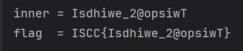

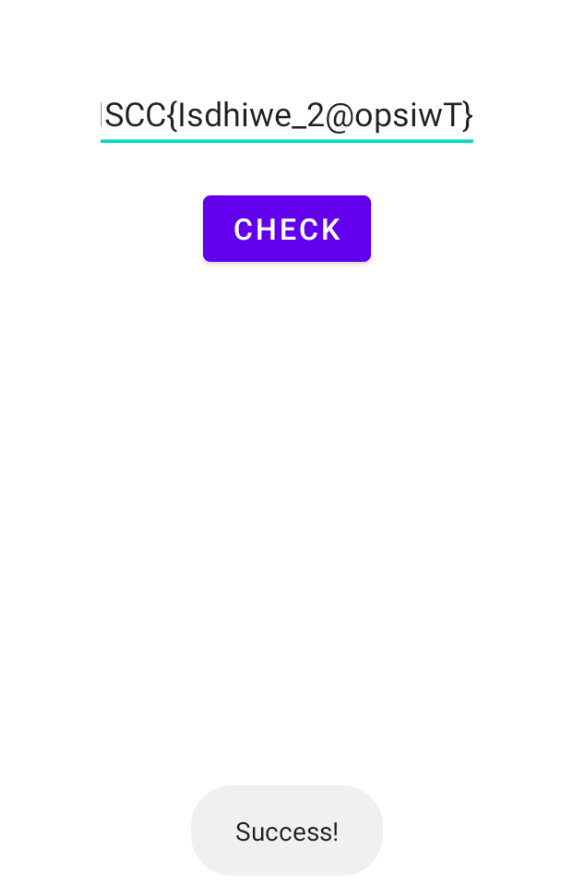

<h1 id="ACNto">mob2</h1>
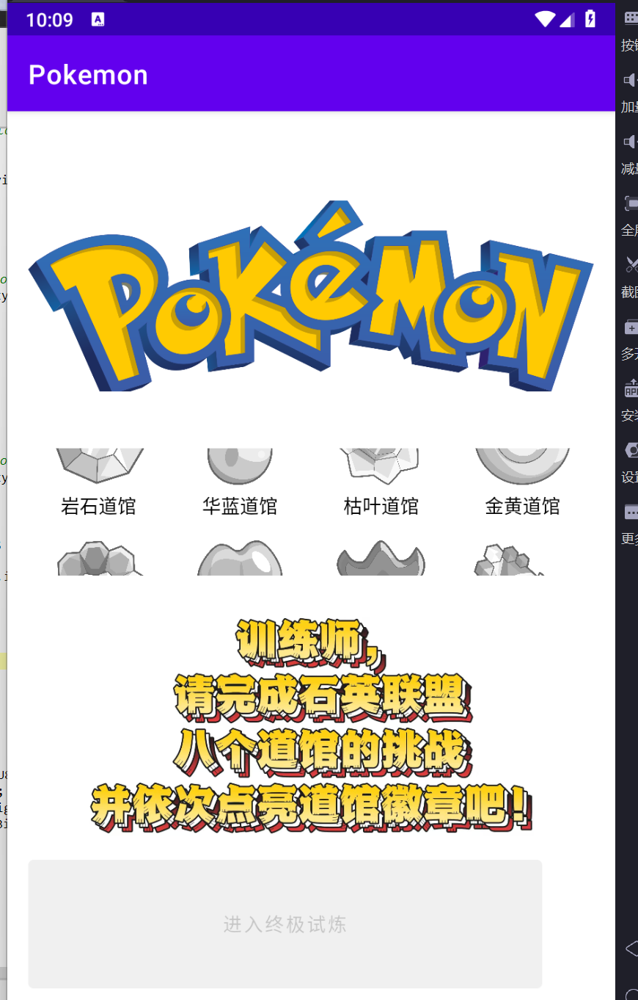

<h2 id="Kcfci">java层分析</h2>
<h3 id="AHHOA">MainActivity类</h3>
```java
package com.example.pokemon;

import android.content.Intent;
import android.graphics.Bitmap;
import android.os.Bundle;
import android.renderscript.Allocation;
import android.renderscript.Element;
import android.renderscript.RenderScript;
import android.renderscript.ScriptIntrinsicBlur;
import android.view.View;
import android.widget.Button;
import androidx.activity.result.ActivityResult;
import androidx.activity.result.ActivityResultCallback;
import androidx.activity.result.ActivityResultLauncher;
import androidx.activity.result.contract.ActivityResultContracts;
import androidx.appcompat.app.AppCompatActivity;
import androidx.recyclerview.widget.GridLayoutManager;
import androidx.recyclerview.widget.RecyclerView;
import com.example.pokemon.BadgeAdapter;
import java.util.List;

/* loaded from: classes.dex */
public class MainActivity extends AppCompatActivity {
    private BadgeAdapter adapter;
    private List<Badge> badges;
    private Button btnProceed;
    private final ActivityResultLauncher<Intent> launcher = registerForActivityResult(new ActivityResultContracts.StartActivityForResult(), new ActivityResultCallback() { // from class: com.example.pokemon.MainActivity$$ExternalSyntheticLambda2
        @Override // androidx.activity.result.ActivityResultCallback
        public final void onActivityResult(Object obj) {
            MainActivity.this.m224lambda$new$0$comexamplepokemonMainActivity((ActivityResult) obj);
        }
    });

    /* JADX INFO: Access modifiers changed from: package-private */
    /* renamed from: lambda$new$0$com-example-pokemon-MainActivity  reason: not valid java name */
    public /* synthetic */ void m224lambda$new$0$comexamplepokemonMainActivity(ActivityResult activityResult) {
        this.adapter.notifyDataSetChanged();
        refreshButton();
    }

    /* JADX INFO: Access modifiers changed from: protected */
    @Override // androidx.fragment.app.FragmentActivity, androidx.activity.ComponentActivity, androidx.core.app.ComponentActivity, android.app.Activity
    public void onCreate(Bundle bundle) {
        super.onCreate(bundle);
        setContentView(R.layout.activity_main);
        RecyclerView recyclerView = (RecyclerView) findViewById(R.id.rvBadges);
        this.btnProceed = (Button) findViewById(R.id.btnProceed);
        recyclerView.setLayoutManager(new GridLayoutManager(this, 4));
        this.badges = BadgeRepository.getAll();
        BadgeAdapter badgeAdapter = new BadgeAdapter(this, this.badges, new BadgeAdapter.OnBadgeClick() { // from class: com.example.pokemon.MainActivity$$ExternalSyntheticLambda0
            @Override // com.example.pokemon.BadgeAdapter.OnBadgeClick
            public final void onClick(Badge badge) {
                MainActivity.this.m225lambda$onCreate$1$comexamplepokemonMainActivity(badge);
            }
        });
        this.adapter = badgeAdapter;
        recyclerView.setAdapter(badgeAdapter);
        refreshButton();
        this.btnProceed.setOnClickListener(new View.OnClickListener() { // from class: com.example.pokemon.MainActivity$$ExternalSyntheticLambda1
            @Override // android.view.View.OnClickListener
            public final void onClick(View view) {
                MainActivity.this.m226lambda$onCreate$2$comexamplepokemonMainActivity(view);
            }
        });
    }

    /* JADX INFO: Access modifiers changed from: package-private */
    /* renamed from: lambda$onCreate$1$com-example-pokemon-MainActivity  reason: not valid java name */
    public /* synthetic */ void m225lambda$onCreate$1$comexamplepokemonMainActivity(Badge badge) {
        Intent intent = new Intent(this, ChallengeActivity.class);
        intent.putExtra("badge_id", badge.id);
        intent.putExtra("badge_name", badge.name);
        intent.putExtra("answer_hash", badge.answerHash);
        intent.putExtra("icon_color", badge.iconColorRes);
        this.launcher.launch(intent);
    }

    /* JADX INFO: Access modifiers changed from: package-private */
    /* renamed from: lambda$onCreate$2$com-example-pokemon-MainActivity  reason: not valid java name */
    public /* synthetic */ void m226lambda$onCreate$2$comexamplepokemonMainActivity(View view) {
        if (BadgeStore.allUnlocked(this)) {
            View rootView = getWindow().getDecorView().getRootView();
            rootView.setDrawingCacheEnabled(true);
            Bitmap createBitmap = Bitmap.createBitmap(rootView.getDrawingCache());
            rootView.setDrawingCacheEnabled(false);
            new SuccessDialogFragment(blurBitmap(createBitmap, 15.0f), R.drawable.image).show(getSupportFragmentManager(), "successDialog");
        }
    }

    private void refreshButton() {
        boolean allUnlocked = BadgeStore.allUnlocked(this);
        this.btnProceed.setEnabled(allUnlocked);
        this.btnProceed.setAlpha(allUnlocked ? 1.0f : 0.5f);
    }

    private Bitmap blurBitmap(Bitmap bitmap, float f) {
        RenderScript create = RenderScript.create(this);
        ScriptIntrinsicBlur create2 = ScriptIntrinsicBlur.create(create, Element.U8_4(create));
        Allocation createFromBitmap = Allocation.createFromBitmap(create, bitmap);
        Bitmap createBitmap = Bitmap.createBitmap(bitmap.getWidth(), bitmap.getHeight(), Bitmap.Config.ARGB_8888);
        Allocation createFromBitmap2 = Allocation.createFromBitmap(create, createBitmap);
        create2.setRadius(f);
        create2.setInput(createFromBitmap);
        create2.forEach(createFromBitmap2);
        createFromBitmap2.copyTo(createBitmap);
        create.destroy();
        return createBitmap;
    }
}
```

对UI界面等进行了设置

<h3 id="UUQV2">BadgeStore类（含so层分析）</h3>
```java
package com.example.pokemon;

import android.content.Context;
import android.content.SharedPreferences;

/* loaded from: classes.dex */
public class BadgeStore {
    private static final String SP = "badge_store";

    private static native String nativeGetBadgeLog(int i);

    static {
        System.loadLibrary("pokemon");
    }

    public static boolean isUnlocked(Context context, int i) {
        return context.getSharedPreferences(SP, 0).getBoolean("badge_" + i, false);
    }

    public static void setUnlocked(Context context, int i, boolean z) {
        SharedPreferences sharedPreferences = context.getSharedPreferences(SP, 0);
        sharedPreferences.getBoolean("badge_" + i, false);
        sharedPreferences.edit().putBoolean("badge_" + i, z).apply();
        if (z) {
            String nativeGetBadgeLog = nativeGetBadgeLog(i);
            String string = sharedPreferences.getString("badge_log", "");
            if (string.contains(nativeGetBadgeLog)) {
                return;
            }
            sharedPreferences.edit().putString("badge_log", string + nativeGetBadgeLog).apply();
        }
    }

    public static int unlockedCount(Context context) {
        int i = 0;
        for (int i2 = 1; i2 <= 8; i2++) {
            if (isUnlocked(context, i2)) {
                i++;
            }
        }
        return i;
    }

    public static boolean allUnlocked(Context context) {
        return unlockedCount(context) == 8;
    }
}
```

使用SharedPreferences存储，文件命名为 badge_store

然后加载本地库libpokemon.so，提供native方法

```java
private static native String nativeGetBadgeLog(int i);
```

---

```java
    public static boolean isUnlocked(Context context, int i) {
        return context.getSharedPreferences(SP, 0).getBoolean("badge_" + i, false);
    }

```

判断徽章是否已经解锁，通过查询badge_store.xml里面的键 badge_i 的布尔值

setUnlocked(context, id, true)  方法每次将badge_id = true写入SharedPreferences

然后通过so层函数nativeGetBadgeLog(id)从so层拿一个字符串片段，拼接进badge_log字符串

这里是flag的提示，下面对这个so层部分分析


unlockedCount 和 allUnlocked 方法设置通关条件，徽章id固定为1-8，条件是8个徽章都解锁


<h4 id="pcLUs">nativeGetBadgeLog（so层）</h4>
```c
__int64 __fastcall Java_com_example_pokemon_BadgeStore_nativeGetBadgeLog(__int64 a1, __int64 a2, int a3)
{
    __int64 (__fastcall *v3)(__int64, void *); // rax
    unsigned int n7; // edx

    v3 = *(__int64 (__fastcall **)(__int64, void *))(*(_QWORD *)a1 + 1336LL);
    n7 = a3 - 1;
    if ( n7 > 7 )
        return v3(a1, &unk_14748);
    else
        return v3(a1, (char *)dword_15AF0 + dword_15AF0[n7]);
}
```

dword_15AF0是int数组

```c
.rodata:0000000000015AF0                                   ; int dword_15AF0[8]
.rodata:0000000000015AF0 58 FD FF FF 94 EE FF FF EE FC     dword_15AF0 dd 0FFFFFD58h, 0FFFFEE94h, 0FFFFFCEEh, 0FFFFF7B7h, 0FFFFF0BBh, 0FFFFF3E3h
.rodata:0000000000015AF0 FF FF B7 F7 FF FF BB F0 FF FF…                                            ; DATA XREF: Java_com_example_pokemon_BadgeStore_nativeGetBadgeLog+13↓o
.rodata:0000000000015B08 F3 F3 FF FF 8A FD FF FF           dd 0FFFFF3F3h, 0FFFFFD8Ah
```

| 原值 | 十进制（有符号） |
| --- | --- |
| 0xFFFFFD58 | -680 |
| 0xFFFFEE94 | -4460 |
| 0xFFFFFCEE | -786 |
| 0xFFFFF7B7 | -2121 |
| 0xFFFFF0BB | -3909 |
| 0xFFFFF3E3 | -3101 |
| 0xFFFFF3F3 | -3085 |
| 0xFFFFFD8A | -630 |


负数，log在.rodata前面

| index (badgeId-1) | 偏移值（十进制） | 字符串地址 |
| --- | --- | --- |
| 0 | -680 | 0x15AF0 - 0x2A8 = 0x15848 |
| 1 | -4460 | 0x15AF0 - 0x116C = 0x14984 |
| 2 | -786 | 0x15AF0 - 0x312 = 0x157DE |
| 3 | -2121 | 0x15AF0 - 0x849 = 0x152A7 |
| 4 | -3909 | 0x15AF0 - 0xF45 = 0x14BAB |
| 5 | -3101 | 0x15AF0 - 0xC1D = 0x14ED3 |
| 6 | -3085 | 0x15AF0 - 0xC0D = 0x14EE3 |
| 7 | -630 | 0x15AF0 - 0x276 = 0x1587A |


逐个跳转之后内容是

```c
0x15848  "Third, sixth；"
0x14984  "Fourth, tenth；"
0x157DE  "Fourth, ninth；"
0x152A7  "Second, fourth；"
0x14BAB  "Third, seventh；"
0x14ED3  "First, third；"
0x14EE3  "Third, fourth；"
0x1587A  "First, eighth "
```

猜测是flag的取值，一共8个对应8个道馆，取道馆flag的片段组成

<h3 id="pLHdi"> Badge类 / BadgeRepository类</h3>
```java
package com.example.pokemon;

/* loaded from: classes.dex */
public class Badge {
    public final String answerHash;
    public final int iconColorRes;
    public final int id;
    public final String name;

    public Badge(int i, String str, int i2, String str2) {
        this.id = i;
        this.name = str;
        this.iconColorRes = i2;
        this.answerHash = str2;
    }
}
```

```java
package com.example.pokemon;

import java.util.ArrayList;
import java.util.List;

/* loaded from: classes.dex */
public class BadgeRepository {
    public static List<Badge> getAll() {
        ArrayList arrayList = new ArrayList();
        arrayList.add(new Badge(1, "岩石道馆", R.drawable.badge1, "045e0c251301214e"));
        arrayList.add(new Badge(2, "华蓝道馆", R.drawable.badge2, "Cr5aE0bqu\""));
        arrayList.add(new Badge(3, "枯叶道馆", R.drawable.badge3, "01850468411918C2358D31BE"));
        arrayList.add(new Badge(4, "金黄道馆", R.drawable.badge4, "C44805F320117A596D6AE7B88B73CF0A"));
        arrayList.add(new Badge(5, "玉虹道馆", R.drawable.badge5, "050237671445B5169675F7"));
        arrayList.add(new Badge(6, "浅红道馆", R.drawable.badge6, "24D8F250A275A414C6D692476031236636"));
        arrayList.add(new Badge(7, "红莲道馆", R.drawable.badge7, "07337BE63BB7975B1183D3E71173989C"));
        arrayList.add(new Badge(8, "常青道馆", R.drawable.badge8, "6115F65510916254717581C527D67233510281B570F175542165A19270965523162251D270F605647112E68227B11223B172B1A540E14264B142F645279125F3"));
        return arrayList;
    }
}
```

设置题目，以及flag密文的比对

<h3 id="v8AtZ">ChallengeActivity类</h3>
```java
package com.example.pokemon;

import android.graphics.Bitmap;
import android.os.Bundle;
import android.renderscript.Allocation;
import android.renderscript.Element;
import android.renderscript.RenderScript;
import android.renderscript.ScriptIntrinsicBlur;
import android.view.MenuItem;
import android.view.View;
import android.widget.Button;
import android.widget.EditText;
import android.widget.ImageView;
import androidx.appcompat.app.AppCompatActivity;
import com.example.pokemon.verifier.Op;
import com.example.pokemon.verifier.PipelineVerifier;
import com.example.pokemon.verifier.Rule;
import com.example.pokemon.verifier.RuleRepository;
import java.util.List;

/* loaded from: classes.dex */
public class ChallengeActivity extends AppCompatActivity {
    private String answerHash;
    private int badgeId;
    private String badgeName;
    private int iconColor;

    /* JADX INFO: Access modifiers changed from: protected */
    @Override // androidx.fragment.app.FragmentActivity, androidx.activity.ComponentActivity, androidx.core.app.ComponentActivity, android.app.Activity
    public void onCreate(Bundle bundle) {
        super.onCreate(bundle);
        setContentView(R.layout.activity_challenge);
        if (getSupportActionBar() != null) {
            getSupportActionBar().setDisplayHomeAsUpEnabled(true);
            getSupportActionBar().setDisplayShowHomeEnabled(true);
        }
        this.badgeId = getIntent().getIntExtra("badge_id", -1);
        this.badgeName = getIntent().getStringExtra("badge_name");
        this.answerHash = getIntent().getStringExtra("answer_hash");
        this.iconColor = getIntent().getIntExtra("icon_color", 0);
        setTitle(this.badgeName);
        final EditText editText = (EditText) findViewById(R.id.etAnswer);
        ((ImageView) findViewById(R.id.imgBanner)).setImageResource(this.iconColor);
        ((Button) findViewById(R.id.btnSubmit)).setOnClickListener(new View.OnClickListener() { // from class: com.example.pokemon.ChallengeActivity$$ExternalSyntheticLambda0
            @Override // android.view.View.OnClickListener
            public final void onClick(View view) {
                ChallengeActivity.this.m222lambda$onCreate$0$comexamplepokemonChallengeActivity(editText, view);
            }
        });
    }

    /* JADX INFO: Access modifiers changed from: package-private */
    /* renamed from: lambda$onCreate$0$com-example-pokemon-ChallengeActivity  reason: not valid java name */
    public /* synthetic */ void m222lambda$onCreate$0$comexamplepokemonChallengeActivity(EditText editText, View view) {
        boolean z;
        String exec;
        String obj = editText.getText().toString();
        Rule forBadge = RuleRepository.forBadge(this.badgeId);
        String str = forBadge.target != null ? forBadge.target : this.answerHash;
        for (List<Op> list : forBadge.pipelines) {
            try {
                exec = PipelineVerifier.exec(this, obj, list, forBadge.caseSensitive);
            } catch (Exception unused) {
            }
            if (forBadge.caseSensitive) {
                if (exec.equals(str)) {
                }
            } else if (exec.equalsIgnoreCase(str)) {
            }
            z = true;
        }
        z = false;
        if (z) {
            BadgeStore.setUnlocked(this, this.badgeId, true);
        }
        showResultDialog(z);
    }

    private void showResultDialog(boolean z) {
        int i = z ? R.drawable.ok_image : R.drawable.error_image;
        View rootView = getWindow().getDecorView().getRootView();
        rootView.setDrawingCacheEnabled(true);
        Bitmap createBitmap = Bitmap.createBitmap(rootView.getDrawingCache());
        rootView.setDrawingCacheEnabled(false);
        new ResultDialogFragment(blurBitmap(createBitmap, 15.0f), i).show(getSupportFragmentManager(), "resultDialog");
    }

    private Bitmap blurBitmap(Bitmap bitmap, float f) {
        Bitmap createBitmap = Bitmap.createBitmap(bitmap.getWidth(), bitmap.getHeight(), Bitmap.Config.ARGB_8888);
        RenderScript create = RenderScript.create(this);
        ScriptIntrinsicBlur create2 = ScriptIntrinsicBlur.create(create, Element.U8_4(create));
        Allocation createFromBitmap = Allocation.createFromBitmap(create, bitmap);
        Allocation createFromBitmap2 = Allocation.createFromBitmap(create, createBitmap);
        create2.setRadius(f);
        create2.setInput(createFromBitmap);
        create2.forEach(createFromBitmap2);
        createFromBitmap2.copyTo(createBitmap);
        create.destroy();
        return createBitmap;
    }

    @Override // android.app.Activity
    public boolean onOptionsItemSelected(MenuItem menuItem) {
        if (menuItem.getItemId() == 16908332) {
            finish();
            return true;
        }
        return super.onOptionsItemSelected(menuItem);
    }
}
```

提交按钮运行方法：

```java
    public /* synthetic */ void m222lambda$onCreate$0$comexamplepokemonChallengeActivity(EditText editText, View view) {
        boolean z;
        String exec;
        String obj = editText.getText().toString();
        Rule forBadge = RuleRepository.forBadge(this.badgeId);
        String str = forBadge.target != null ? forBadge.target : this.answerHash;
        for (List<Op> list : forBadge.pipelines) {
            try {
                exec = PipelineVerifier.exec(this, obj, list, forBadge.caseSensitive);
            } catch (Exception unused) {
            }
            if (forBadge.caseSensitive) {
                if (exec.equals(str)) {
                }
            } else if (exec.equalsIgnoreCase(str)) {
            }
            z = true;
        }
        z = false;
        if (z) {
            BadgeStore.setUnlocked(this, this.badgeId, true);
        }
        showResultDialog(z);
    }
```

每个徽章都对应一个 Rule 对象

```java
Rule forBadge = RuleRepository.forBadge(this.badgeId);
```

<h3 id="tX0ag">Rule类</h3>
```java
package com.example.pokemon.verifier;

import java.util.List;

/* loaded from: classes.dex */
public class Rule {
    public final boolean caseSensitive;
    public final List<List<Op>> pipelines;
    public final String target;

    public Rule(List<List<Op>> list, String str, boolean z) {
        this.pipelines = list;
        this.target = str;
        this.caseSensitive = z;
    }
}
```

设定关卡数据规则

<h3 id="IQCwQ">PipelineVerifier类</h3>
```java
package com.example.pokemon.verifier;

import android.content.Context;
import java.util.List;

/* loaded from: classes.dex */
public class PipelineVerifier {
    public static String exec(Context context, String str, List<Op> list, boolean z) throws Exception {
        if (str == null) {
            return null;
        }
        for (Op op : list) {
            str = op.apply(context, str);
        }
        return str;
    }

    public static boolean verify(Context context, String str, List<Op> list, String str2, boolean z) {
        try {
            String exec = exec(context, str, list, z);
            if (exec == null) {
                return false;
            }
            return z ? exec.equals(str2) : exec.equalsIgnoreCase(str2);
        } catch (Exception unused) {
            return false;
        }
    }
}
```

批量执行器，同时进行比对

<h3 id="hf6Wi">RuleRepository类（道馆通关对应的加密）</h3>
```java
package com.example.pokemon.verifier;

import com.example.pokemon.verifier.op.AOp;
import com.example.pokemon.verifier.op.BOp;
import com.example.pokemon.verifier.op.COp;
import com.example.pokemon.verifier.op.DOp;
import com.example.pokemon.verifier.op.EOp;
import java.util.ArrayList;
import java.util.Collections;

/* loaded from: classes.dex */
public class RuleRepository {
    public static Rule forBadge(int i) {
        int max = Math.max(1, Math.min(8, i));
        ArrayList arrayList = new ArrayList();
        switch (max) {
            case 1:
                arrayList.add(new AOp());
                break;
            case 2:
                arrayList.add(new BOp());
                break;
            case 3:
                arrayList.add(new COp());
                break;
            case 4:
                arrayList.add(new DOp());
                break;
            case 5:
                arrayList.add(new EOp());
                break;
            case 6:
                arrayList.add(new AOp());
                arrayList.add(new BOp());
                arrayList.add(new COp());
                break;
            case 7:
                arrayList.add(new BOp());
                arrayList.add(new COp());
                arrayList.add(new DOp());
                break;
            case 8:
                arrayList.add(new COp());
                arrayList.add(new DOp());
                arrayList.add(new EOp());
                break;
        }
        return new Rule(Collections.singletonList(arrayList), null, true);
    }
}
```

根据不同徽章(道馆)的id进入不同的操作规则

<h3 id="SfsNu">FinalFlagActivity类（终极试炼）</h3>
```python
package com.example.pokemon;

import android.graphics.Bitmap;
import android.graphics.drawable.AnimatedImageDrawable;
import android.graphics.drawable.Drawable;
import android.os.Build;
import android.os.Bundle;
import android.renderscript.Allocation;
import android.renderscript.Element;
import android.renderscript.RenderScript;
import android.renderscript.ScriptIntrinsicBlur;
import android.view.View;
import android.widget.EditText;
import android.widget.ImageButton;
import android.widget.ImageView;
import androidx.appcompat.app.AppCompatActivity;
import java.security.MessageDigest;

/* loaded from: classes.dex */
public class FinalFlagActivity extends AppCompatActivity {
    private static final String PRESET_FINAL_HASH = "8041ef524a8afcc1ad75efdfcaf8a053885e612e6585947f23d25146c722c409";

    /* JADX INFO: Access modifiers changed from: protected */
    @Override // androidx.fragment.app.FragmentActivity, androidx.activity.ComponentActivity, androidx.core.app.ComponentActivity, android.app.Activity
    public void onCreate(Bundle bundle) {
        super.onCreate(bundle);
        setContentView(R.layout.activity_final_flag);
        setTitle("终极试炼");
        Drawable background = ((ImageView) findViewById(R.id.imgFinalBanner)).getBackground();
        if (Build.VERSION.SDK_INT >= 28 && (background instanceof AnimatedImageDrawable)) {
            ((AnimatedImageDrawable) background).start();
        }
        final EditText editText = (EditText) findViewById(R.id.etFinalFlag);
        ((ImageButton) findViewById(R.id.btnFinalSubmit)).setOnClickListener(new View.OnClickListener() { // from class: com.example.pokemon.FinalFlagActivity$$ExternalSyntheticLambda0
            @Override // android.view.View.OnClickListener
            public final void onClick(View view) {
                FinalFlagActivity.this.m223lambda$onCreate$0$comexamplepokemonFinalFlagActivity(editText, view);
            }
        });
    }

    /* JADX INFO: Access modifiers changed from: package-private */
    /* renamed from: lambda$onCreate$0$com-example-pokemon-FinalFlagActivity  reason: not valid java name */
    public /* synthetic */ void m223lambda$onCreate$0$comexamplepokemonFinalFlagActivity(EditText editText, View view) {
        String trim = editText.getText().toString().trim();
        if (trim.isEmpty()) {
            showResult(false);
        } else {
            showResult(sha256(sha256(trim)).equalsIgnoreCase(PRESET_FINAL_HASH));
        }
    }

    private void showResult(boolean z) {
        int i = z ? R.drawable.success : R.drawable.fail;
        View rootView = getWindow().getDecorView().getRootView();
        rootView.setDrawingCacheEnabled(true);
        Bitmap createBitmap = Bitmap.createBitmap(rootView.getDrawingCache());
        rootView.setDrawingCacheEnabled(false);
        new ResultDialogFragment(blurBitmap(createBitmap, 15.0f), i).show(getSupportFragmentManager(), "flagResult");
    }

    private String sha256(String str) {
        try {
            byte[] digest = MessageDigest.getInstance("SHA-256").digest(str.getBytes());
            StringBuilder sb = new StringBuilder();
            for (byte b : digest) {
                sb.append(String.format("%02x", Byte.valueOf(b)));
            }
            return sb.toString();
        } catch (Exception unused) {
            return "";
        }
    }

    private Bitmap blurBitmap(Bitmap bitmap, float f) {
        RenderScript create = RenderScript.create(this);
        ScriptIntrinsicBlur create2 = ScriptIntrinsicBlur.create(create, Element.U8_4(create));
        Allocation createFromBitmap = Allocation.createFromBitmap(create, bitmap);
        Bitmap createBitmap = Bitmap.createBitmap(bitmap.getWidth(), bitmap.getHeight(), Bitmap.Config.ARGB_8888);
        Allocation createFromBitmap2 = Allocation.createFromBitmap(create, createBitmap);
        create2.setRadius(f);
        create2.setInput(createFromBitmap);
        create2.forEach(createFromBitmap2);
        createFromBitmap2.copyTo(createBitmap);
        create.destroy();
        return createBitmap;
    }
}
```

双重哈希SHA-256，不可逆

与常量对比，结合前面Badge日志信息

```python
First, third；

Second, fourth；

Third, fourth；

Third, sixth；

Third, seventh；

Fourth, ninth；

Fourth, tenth；

First, eighth
```

<h3 id="HdIav">Op接口（嵌so层分析）</h3>
<h4 id="wTg4O">AOp类</h4>
XOR + hex  小写输出

```java
package com.example.pokemon.verifier.op;

import android.content.Context;
import com.example.pokemon.R;
import com.example.pokemon.verifier.Op;
import java.io.BufferedReader;
import java.io.InputStreamReader;
import java.nio.charset.StandardCharsets;

/* loaded from: classes.dex */
public class AOp implements Op {
    private static volatile byte[] cachedKey;

    @Override // com.example.pokemon.verifier.Op
    public String apply(Context context, String str) throws Exception {
        if (str == null) {
            return "";
        }
        byte[] loadKeyBytes = loadKeyBytes(context);
        if (loadKeyBytes.length == 0) {
            return "";
        }
        byte[] bytes = str.getBytes(StandardCharsets.UTF_8);
        int length = bytes.length;
        byte[] bArr = new byte[length];
        for (int i = 0; i < bytes.length; i++) {
            bArr[i] = (byte) (bytes[i] ^ loadKeyBytes[i % loadKeyBytes.length]);
        }
        StringBuilder sb = new StringBuilder();
        for (int i2 = 0; i2 < length; i2++) {
            sb.append(String.format("%02x", Byte.valueOf(bArr[i2])));
        }
        return sb.toString();
    }

    private static byte[] loadKeyBytes(Context context) {
        BufferedReader bufferedReader;
        if (cachedKey != null) {
            return cachedKey;
        }
        synchronized (AOp.class) {
            if (cachedKey != null) {
                return cachedKey;
            }
            try {
                bufferedReader = new BufferedReader(new InputStreamReader(context.getResources().openRawResource(R.raw.key), StandardCharsets.UTF_8));
            } catch (Exception unused) {
                cachedKey = new byte[0];
            }
            try {
                StringBuilder sb = new StringBuilder();
                while (true) {
                    String readLine = bufferedReader.readLine();
                    if (readLine == null) {
                        break;
                    }
                    sb.append(readLine);
                }
                cachedKey = sb.toString().trim().getBytes(StandardCharsets.UTF_8);
                bufferedReader.close();
                return cachedKey;
            } catch (Throwable th) {
                try {
                    bufferedReader.close();
                } catch (Throwable th2) {
                    th.addSuppressed(th2);
                }
                throw th;
            }
        }
    }
}
```

+ 输入：明文字符串 `s`
+ 转字节：`bytes = UTF-8(s)`
+ 用 key `"Togepi"` 循环异或：
+ `out[i] = bytes[i] XOR key[i mod keyLen]`
+ 输出：`out` 的每个字节变成 **两位小写十六进制** 拼接成字符串


<h4 id="cciin">BOp类</h4>
高位 nibble 重排 + 字符串反转

```java
package com.example.pokemon.verifier.op;

import android.content.Context;
import com.example.pokemon.verifier.Op;
import java.nio.charset.StandardCharsets;
import java.util.ArrayList;

/* loaded from: classes.dex */
public class BOp implements Op {
    @Override // com.example.pokemon.verifier.Op
    public String apply(Context context, String str) throws Exception {
        if (str == null) {
            return "";
        }
        return new StringBuilder(new String(hexToBytes(reverseOddPositionsOneBased(toHexUpper(str.getBytes(StandardCharsets.UTF_8)))), StandardCharsets.US_ASCII)).reverse().toString();
    }

    private static String toHexUpper(byte[] bArr) {
        StringBuilder sb = new StringBuilder(bArr.length * 2);
        for (byte b : bArr) {
            sb.append(String.format("%02X", Byte.valueOf(b)));
        }
        return sb.toString();
    }

    private static String reverseOddPositionsOneBased(String str) {
        char[] charArray = str.toCharArray();
        ArrayList arrayList = new ArrayList();
        int i = 0;
        for (int i2 = 0; i2 < charArray.length; i2 += 2) {
            arrayList.add(Character.valueOf(charArray[i2]));
        }
        int size = arrayList.size() - 1;
        while (i < charArray.length) {
            charArray[i] = ((Character) arrayList.get(size)).charValue();
            i += 2;
            size--;
        }
        return new String(charArray);
    }

    private static byte[] hexToBytes(String str) throws IllegalArgumentException {
        int length = str.length();
        if ((length & 1) == 1) {
            throw new IllegalArgumentException("HEX length must be even");
        }
        byte[] bArr = new byte[length / 2];
        for (int i = 0; i < length; i += 2) {
            int digit = Character.digit(str.charAt(i), 16);
            int digit2 = Character.digit(str.charAt(i + 1), 16);
            if (digit < 0 || digit2 < 0) {
                throw new IllegalArgumentException("Invalid HEX character at " + i);
            }
            bArr[i / 2] = (byte) ((digit << 4) + digit2);
        }
        return bArr;
    }
}
```

1. `str` → UTF-8 字节；
2. `toHexUpper`：字节转大写 HEX：

```java
sb.append(String.format("%02X", b));
```

3. `reverseOddPositionsOneBased`：对 hex 字符串做“奇怪的重排”；
4. `hexToBytes`：把这个新的 hex 字符串还原为字节；
5. 这些字节按 ASCII 解码成字符串；
6. 最后把字符串整体 `reverse()` 反转。

     `reverseOddPositionsOneBased`：

+ 把 hex 字符串中所有**偶数下标（0,2,4,...) 的字符**收集起来
+ 然后把这批字符逆序写回到这些偶数下标；
+ 奇数下标上的字符不动。

也就是说：**对每个字节的高半字节（高 nibble）做一次全局逆序排列，低 nibble 不变**。这是一个可逆变换，函数本身就是自反的（调用两次会回到原来）

<h4 id="iCL5T">COp类</h4>
java壳 + native层算法

res/raw/key2读出字符串，UTF-8编码，再调用so层函数

```java
package com.example.pokemon.verifier.op;

import android.content.Context;
import com.example.pokemon.R;
import com.example.pokemon.verifier.Op;
import java.io.BufferedReader;
import java.io.InputStreamReader;
import java.nio.charset.StandardCharsets;

/* loaded from: classes.dex */
public class COp implements Op {
    private static native String nativeProcess(byte[] bArr, byte[] bArr2);

    static {
        System.loadLibrary("pokemon");
    }

    @Override // com.example.pokemon.verifier.Op
    public String apply(Context context, String str) throws Exception {
        String nativeProcess;
        return (str == null || (nativeProcess = nativeProcess(str.getBytes(StandardCharsets.UTF_8), loadKeyBytesFromRaw(context, R.raw.key2))) == null) ? "" : nativeProcess;
    }

    private static byte[] loadKeyBytesFromRaw(Context context, int i) {
        try {
            BufferedReader bufferedReader = new BufferedReader(new InputStreamReader(context.getResources().openRawResource(i), StandardCharsets.UTF_8));
            StringBuilder sb = new StringBuilder();
            while (true) {
                String readLine = bufferedReader.readLine();
                if (readLine == null) {
                    byte[] bytes = sb.toString().trim().getBytes(StandardCharsets.UTF_8);
                    bufferedReader.close();
                    return bytes;
                }
                sb.append(readLine);
            }
        } catch (Exception unused) {
            return new byte[0];
        }
    }
}
```

<h5 id="k8Wbt">nativeProcess（so层）</h5>
```c
__int64 __fastcall Java_com_example_pokemon_verifier_op_COp_nativeProcess(
        __int64 a1,
        __int64 a2,
        __int64 a3,
        __int64 a4)
{
  int n_2; // eax
  int n; // ebp
  char *s; // r14
  char *s_2; // rbx
  int n_3; // eax
  int n_1; // ebp
  char *s_1; // r15
  char *s_3; // r12
  __int64 v14; // rcx
  unsigned __int64 v15; // r15
  unsigned __int64 v16; // rdx
  unsigned __int64 v17; // rdi
  unsigned __int64 v18; // rax
  unsigned __int64 v19; // rcx
  char *ptr_10; // rdi
  unsigned __int8 v21; // si
  char *ptr_11; // rdi
  __int64 v23; // rsi
  unsigned __int64 v24; // rsi
  bool v25; // al
  unsigned __int64 v26; // r13
  unsigned __int64 v27; // rcx
  char *ptr_12; // rcx
  __m128i *v29; // rdi
  __int64 v30; // rcx
  __int8 *ptr_13; // rax
  char *ptr_14; // rcx
  char *v33; // rax
  char v34; // dl
  bool v35; // cf
  __int64 v36; // rcx
  char *ptr_1; // rax
  char *ptr_2; // rcx
  char *v39; // rax
  char v40; // dl
  __int64 v41; // rsi
  int v42; // r9d
  unsigned __int64 v43; // r13
  unsigned __int64 s_8; // rbp
  unsigned __int64 s_5; // rcx
  char v46; // al
  char *s_4; // rsi
  unsigned __int64 s_11; // rdi
  int v49; // edx
  char *ptr_3; // rax
  __int8 *ptr_15; // rcx
  __int64 v52; // rsi
  void *ptr_9; // r14
  unsigned __int64 n0x20; // rax
  int v55; // r8d
  __m128i v56; // xmm0
  __int64 s_9; // rdx
  __m128i v58; // xmm1
  __m128i v59; // xmm1
  unsigned __int64 s_10; // rdi
  __m128i v61; // xmm0
  __int64 v62; // rcx
  char *ptr_5; // rdx
  __int64 v64; // rax
  __int8 *ptr_6; // rsi
  __int64 v66; // rbx
  char v68; // [rsp+0h] [rbp-108h]
  __int128 v70; // [rsp+10h] [rbp-F8h] BYREF
  char *ptr_7; // [rsp+20h] [rbp-E8h]
  __int128 v72; // [rsp+30h] [rbp-D8h] BYREF
  void *ptr_8; // [rsp+40h] [rbp-C8h]
  void *v74[2]; // [rsp+50h] [rbp-B8h] BYREF
  char *s_7; // [rsp+60h] [rbp-A8h]
  void *v76[2]; // [rsp+70h] [rbp-98h] BYREF
  char *s_6; // [rsp+80h] [rbp-88h]
  __int128 v78; // [rsp+90h] [rbp-78h] BYREF
  void *ptr; // [rsp+A0h] [rbp-68h]
  __m128i v80; // [rsp+B0h] [rbp-58h] BYREF
  void *ptr_4; // [rsp+C0h] [rbp-48h]
  unsigned int v82; // [rsp+CCh] [rbp-3Ch] BYREF
  unsigned __int64 v83; // [rsp+D0h] [rbp-38h]

  v83 = __readfsqword(0x28u);
  n_2 = (*(__int64 (__fastcall **)(__int64, __int64))(*(_QWORD *)a1 + 1368LL))(a1, a3);
  n = n_2;
  *(_OWORD *)v76 = 0;
  s_6 = 0;
  v68 = a4;
  if ( n_2 )
  {
    if ( n_2 < 0 )
      sub_21C60(v76);
    s = (char *)operator new(n_2);
    v76[0] = s;
    s_2 = &s[n];
    s_6 = s_2;
    memset(s, 0, n);
    v76[1] = s_2;
  }
  else
  {
    s_2 = 0;
    s = 0;
  }
  (*(void (__fastcall **)(__int64, __int64, _QWORD, _QWORD, char *))(*(_QWORD *)a1 + 1600LL))(
    a1,
    a3,
    0,
    (unsigned int)n,
    s);
  n_3 = (*(__int64 (__fastcall **)(__int64, __int64))(*(_QWORD *)a1 + 1368LL))(a1, a4);
  n_1 = n_3;
  *(_OWORD *)v74 = 0;
  s_7 = 0;
  if ( n_3 )
  {
    if ( n_3 < 0 )
      sub_21C60(v74);
    s_1 = (char *)operator new(n_3);
    v74[0] = s_1;
    s_3 = &s_1[n_1];
    s_7 = s_3;
    memset(s_1, 0, n_1);
    v74[1] = s_3;
  }
  else
  {
    s_3 = 0;
    s_1 = 0;
  }
  (*(void (__fastcall **)(__int64, __int64, _QWORD, _QWORD, char *))(*(_QWORD *)a1 + 1600LL))(
    a1,
    a4,
    0,
    (unsigned int)n_1,
    s_1);
  if ( s_1 != s_3 )
  {
    v15 = 0;
    if ( s_2 == s )
    {
      s = s_2;
      goto LABEL_22;
    }
    do
    {
      v17 = (char *)v74[1] - (char *)v74[0];
      if ( (((char *)v74[1] - (char *)v74[0]) | v15) >> 32 )
        v16 = v15 % v17;
      else
        v16 = (unsigned int)v15 % (unsigned int)v17;
      s[v15++] ^= *((_BYTE *)v74[0] + v16);
      s = (char *)v76[0];
      s_2 = (char *)v76[1];
    }
    while ( v15 < (char *)v76[1] - (char *)v76[0] );
  }
  v14 = 0;
  if ( s_2 == s )
  {
    v15 = 0;
    s_2 = s;
  }
  else
  {
    v18 = 0;
    do
    {
      if ( (v14 & 7) != 0 )
      {
        s[v18] = __ROL1__(s[v18], v14);
        s = (char *)v76[0];
        s_2 = (char *)v76[1];
      }
      ++v18;
      v15 = s_2 - s;
      v14 = (unsigned int)(v14 + 3);
    }
    while ( v18 < s_2 - s );
  }
LABEL_22:
  v72 = 0;
  ptr_8 = 0;
  std::string::resize(&v72, 2 * v15, 0, v14);
  if ( s_2 != s )
  {
    v19 = 0;
    do
    {
      ptr_10 = (char *)&v72 + 1;
      if ( (v72 & 1) != 0 )
        ptr_10 = (char *)ptr_8;
      v21 = s[v19];
      ptr_10[2 * v19] = a0123456789abcd[v21 >> 4];
      ptr_11 = (char *)&v72 + 1;
      if ( (v72 & 1) != 0 )
        ptr_11 = (char *)ptr_8;
      ptr_11[2 * v19++ + 1] = a0123456789abcd[v21 & 0xF];
    }
    while ( v19 < v15 );
  }
  v80 = 0;
  ptr_4 = 0;
  v78 = 0;
  ptr = 0;
  if ( (v72 & 1) != 0 )
    v23 = *((_QWORD *)&v72 + 1);
  else
    v23 = (unsigned __int8)v72 >> 1;
  std::string::reserve(&v80, (unsigned __int64)(v23 + 1) >> 1);
  if ( (v72 & 1) != 0 )
    v24 = *((_QWORD *)&v72 + 1);
  else
    v24 = (unsigned __int8)v72 >> 1;
  std::string::reserve(&v78, v24 >> 1);
  v25 = (v72 & 1) == 0;
  if ( (v72 & 1) != 0 )
  {
    if ( !*((_QWORD *)&v72 + 1) )
      goto LABEL_48;
LABEL_39:
    v26 = 0;
    do
    {
      ptr_12 = (char *)&v72 + 1;
      if ( !v25 )
        ptr_12 = (char *)ptr_8;
      v29 = (__m128i *)&v78;
      if ( (v26 & 1) == 0 )
        v29 = &v80;
      std::string::push_back(v29, (unsigned int)ptr_12[v26]);
      v25 = (v72 & 1) == 0;
      if ( (v72 & 1) != 0 )
        v27 = *((_QWORD *)&v72 + 1);
      else
        v27 = (unsigned __int8)v72 >> 1;
      ++v26;
    }
    while ( v26 < v27 );
    goto LABEL_48;
  }
  if ( (unsigned __int8)v72 >> 1 )
    goto LABEL_39;
LABEL_48:
  v30 = v80.m128i_u8[0] >> 1;
  ptr_13 = (__int8 *)ptr_4;
  if ( (v80.m128i_i8[0] & 1) != 0 )
    v30 = v80.m128i_i64[1];
  else
    ptr_13 = &v80.m128i_i8[1];
  if ( v30 )
  {
    ptr_14 = &ptr_13[v30 - 1];
    if ( ptr_14 > ptr_13 )
    {
      v33 = ptr_13 + 1;
      do
      {
        v34 = *(v33 - 1);
        *(v33 - 1) = *ptr_14;
        *ptr_14-- = v34;
        v35 = v33++ < ptr_14;
      }
      while ( v35 );
    }
  }
  v36 = (unsigned __int8)v78 >> 1;
  ptr_1 = (char *)ptr;
  if ( (v78 & 1) != 0 )
    v36 = *((_QWORD *)&v78 + 1);
  else
    ptr_1 = (char *)&v78 + 1;
  if ( v36 )
  {
    ptr_2 = &ptr_1[v36 - 1];
    if ( ptr_2 > ptr_1 )
    {
      v39 = ptr_1 + 1;
      do
      {
        v40 = *(v39 - 1);
        *(v39 - 1) = *ptr_2;
        *ptr_2-- = v40;
        v35 = v39++ < ptr_2;
      }
      while ( v35 );
    }
  }
  v70 = 0;
  ptr_7 = 0;
  if ( (v72 & 1) != 0 )
    v41 = *((_QWORD *)&v72 + 1);
  else
    v41 = (unsigned __int8)v72 >> 1;
  std::string::reserve(&v70, v41);
  v43 = 0;
  s_8 = 0;
  while ( 1 )
  {
    v49 = (unsigned __int8)v78;
    if ( (v78 & 1) != 0 )
    {
      if ( v43 < *((_QWORD *)&v78 + 1) )
        goto LABEL_76;
    }
    else if ( v43 < (unsigned __int8)v78 >> 1 )
    {
LABEL_76:
      ptr_3 = (char *)&v78 + 1;
      if ( (v78 & 1) != 0 )
        ptr_3 = (char *)ptr;
      std::string::push_back(&v70, (unsigned int)ptr_3[v43++]);
      s_4 = (char *)v80.m128i_i64[1];
      v46 = v80.m128i_i8[0] & 1;
      s_5 = v80.m128i_u8[0] >> 1;
      goto LABEL_69;
    }
    s_5 = v80.m128i_u8[0] >> 1;
    v46 = v80.m128i_i8[0] & 1;
    s_4 = (char *)v80.m128i_i64[1];
    s_11 = v80.m128i_u64[1];
    if ( (v80.m128i_i8[0] & 1) == 0 )
      s_11 = v80.m128i_u8[0] >> 1;
    if ( s_8 >= s_11 )
      break;
LABEL_69:
    if ( v46 )
      s_5 = (unsigned __int64)s_4;
    if ( s_8 < s_5 )
    {
      ptr_15 = &v80.m128i_i8[1];
      if ( v46 )
        ptr_15 = (__int8 *)ptr_4;
      v52 = (unsigned int)ptr_15[s_8++];
      std::string::push_back(&v70, v52);
    }
  }
  if ( (v78 & 1) != 0 )
  {
    operator delete(ptr);
    v46 = v80.m128i_i8[0] & 1;
  }
  if ( v46 )
    operator delete(ptr_4);
  ptr_9 = v76[0];
  if ( v76[0] == s_2 )
  {
    v55 = 0;
  }
  else
  {
    n0x20 = s_2 - (char *)v76[0];
    if ( (unsigned __int64)(s_2 - (char *)v76[0]) < 8 )
    {
      v49 = 0;
      s_4 = (char *)v76[0];
      goto LABEL_101;
    }
    if ( n0x20 >= 0x20 )
    {
      s_5 = n0x20 & 0xFFFFFFFFFFFFFFE0LL;
      v56 = 0;
      s_9 = 0;
      v58 = 0;
      do
      {
        v56 = _mm_add_epi8(v56, _mm_loadu_si128((const __m128i *)((char *)v76[0] + s_9)));
        v58 = _mm_add_epi8(v58, _mm_loadu_si128((const __m128i *)((char *)v76[0] + s_9 + 16)));
        s_9 += 32;
      }
      while ( s_5 != s_9 );
      v59 = _mm_add_epi8(v58, v56);
      v49 = _mm_cvtsi128_si32(_mm_sad_epu8((__m128i)0LL, _mm_add_epi8(_mm_shuffle_epi32(v59, 238), v59)));
      if ( n0x20 != s_5 )
      {
        if ( (n0x20 & 0x18) == 0 )
        {
          s_5 += (unsigned __int64)v76[0];
          s_4 = (char *)s_5;
          goto LABEL_101;
        }
        goto LABEL_96;
      }
    }
    else
    {
      LOBYTE(v49) = 0;
      s_5 = 0;
LABEL_96:
      s_10 = n0x20 & 0xFFFFFFFFFFFFFFF8LL;
      s_4 = (char *)v76[0] + (n0x20 & 0xFFFFFFFFFFFFFFF8LL);
      v61 = _mm_cvtsi32_si128((unsigned __int8)v49);
      do
      {
        v61 = _mm_add_epi8(v61, _mm_loadl_epi64((const __m128i *)((char *)v76[0] + s_5)));
        s_5 += 8LL;
      }
      while ( s_10 != s_5 );
      v49 = _mm_cvtsi128_si32(_mm_sad_epu8(v61, (__m128i)0LL));
      if ( n0x20 != s_10 )
      {
        do
LABEL_101:
          LOBYTE(v49) = *s_4++ + v49;
        while ( s_4 != s_2 );
      }
    }
    v55 = (unsigned __int8)v49;
  }
  sub_21B30((unsigned int)&v82, s_4, v49, s_5, v55, v42, v68);
  LOBYTE(v78) = 4;
  *(_WORD *)((char *)&v78 + 1) = v82;
  v62 = (unsigned __int8)v70 >> 1;
  ptr_5 = (char *)&v70 + 1;
  if ( (v70 & 1) != 0 )
    ptr_5 = ptr_7;
  BYTE3(v78) = 0;
  if ( (v70 & 1) != 0 )
    v62 = *((_QWORD *)&v70 + 1);
  v64 = std::string::insert(&v78, 0, ptr_5, v62);
  ptr_4 = *(void **)(v64 + 16);
  v80 = _mm_loadu_si128((const __m128i *)v64);
  *(_OWORD *)v64 = 0;
  *(_QWORD *)(v64 + 16) = 0;
  if ( (v78 & 1) != 0 )
    operator delete(ptr);
  if ( (v80.m128i_i8[0] & 1) != 0 )
    ptr_6 = (__int8 *)ptr_4;
  else
    ptr_6 = &v80.m128i_i8[1];
  v66 = (*(__int64 (__fastcall **)(__int64, __int8 *))(*(_QWORD *)a1 + 1336LL))(a1, ptr_6);
  if ( (v80.m128i_i8[0] & 1) == 0 )
  {
    if ( (v70 & 1) == 0 )
      goto LABEL_114;
LABEL_122:
    operator delete(ptr_7);
    if ( (v72 & 1) == 0 )
      goto LABEL_116;
LABEL_115:
    operator delete(ptr_8);
    goto LABEL_116;
  }
  operator delete(ptr_4);
  if ( (v70 & 1) != 0 )
    goto LABEL_122;
LABEL_114:
  if ( (v72 & 1) != 0 )
    goto LABEL_115;
LABEL_116:
  if ( v74[0] )
    operator delete(v74[0]);
  if ( ptr_9 )
    operator delete(ptr_9);
  return v66;
}
```

1. 用key字节对输入做一次循环XOR
2. 按位对每个字节做bit rotate（循环左移）混淆
3. 用特定的表把结果转成十六进制字符串
4. 然后把hex拆成两部分，反转，交织
5. 对原始的输入做一次checksum / 统计，调用sub_21B30得到两个字节v82  

```c
unsigned __int64 sub_21B30(char *s_1, char *s, __int64 a3, unsigned __int64 a4, ...)
{
  gcc_va_list arg; // [rsp+B0h] [rbp-28h] BYREF
  unsigned __int64 v6; // [rsp+D0h] [rbp-8h]

  va_start(arg, a4);
  v6 = __readfsqword(0x28u);
  vsnprintf(s_1, 3u, "%02X", arg);
  return __readfsqword(0x28u);
}
```

6. 最后作为UTF-8字节数组，传回 java 层

<h4 id="iKGWQ">DOp类</h4>
AES/CBC/PKCS5Padding 加密 --> 十六进制

```java
package com.example.pokemon.verifier.op;

import android.content.Context;
import com.example.pokemon.verifier.Op;
import java.nio.charset.StandardCharsets;
import javax.crypto.Cipher;
import javax.crypto.spec.IvParameterSpec;
import javax.crypto.spec.SecretKeySpec;

/* loaded from: classes.dex */
public class DOp implements Op {
    private static native byte[] nativeGetIv();

    private static native byte[] nativeGetKey();

    static {
        System.loadLibrary("pokemon");
    }

    @Override // com.example.pokemon.verifier.Op
    public String apply(Context context, String str) throws Exception {
        if (str == null) {
            return "";
        }
        byte[] nativeGetKey = nativeGetKey();
        byte[] nativeGetIv = nativeGetIv();
        Cipher cipher = Cipher.getInstance("AES/CBC/PKCS5Padding");
        cipher.init(1, new SecretKeySpec(nativeGetKey, "AES"), new IvParameterSpec(nativeGetIv));
        return toHex(cipher.doFinal(str.getBytes(StandardCharsets.UTF_8)));
    }

    private static String toHex(byte[] bArr) {
        StringBuilder sb = new StringBuilder(bArr.length * 2);
        for (byte b : bArr) {
            sb.append(String.format("%02X", Byte.valueOf(b)));
        }
        return sb.toString();
    }
}
```

<h5 id="cpbBC">so层</h5>
```c
__int64 __fastcall Java_com_example_pokemon_verifier_op_DOp_nativeGetKey(
    __int64 a1,
    __int64 a2,
    __int64 a3,
    __int64 a4,
    __int64 a5,
    __int64 a6)
{
    __int64 v6; // rbx
    __int128 v8; // [rsp+0h] [rbp-28h] BYREF

    v6 = (*(__int64 (__fastcall **)(__int64, __int64, __int64, __int64, __int64, __int64, __int64, __int64, unsigned __int64))(*(_QWORD *)a1 + 1408LL))(
        a1,
        16,
        a3,
        a4,
        a5,
        a6,
        0x3512756085D424FLL,
        0x4E3552416F481174LL,
        __readfsqword(0x28u));
    (*(void (__fastcall **)(__int64, __int64, _QWORD, __int64, __int128 *))(*(_QWORD *)a1 + 1664LL))(a1, v6, 0, 16, &v8);
    return v6;
}
```

```c
__int64 __fastcall Java_com_example_pokemon_verifier_op_DOp_nativeGetIv(
        __int64 a1,
        __int64 a2,
        __int64 a3,
        __int64 a4,
        __int64 a5,
        __int64 a6)
{
  __int64 v6; // rbx
  __int128 v8; // [rsp+0h] [rbp-28h] BYREF

  v6 = (*(__int64 (__fastcall **)(__int64, __int64, __int64, __int64, __int64, __int64, __int64, __int64, unsigned __int64))(*(_QWORD *)a1 + 1408LL))(
         a1,
         16,
         a3,
         a4,
         a5,
         a6,
         0x35260C307201221ALL,
         0x6D043B216910170DLL,
         __readfsqword(0x28u));
  (*(void (__fastcall **)(__int64, __int64, _QWORD, __int64, __int128 *))(*(_QWORD *)a1 + 1664LL))(a1, v6, 0, 16, &v8);
  return v6;
}
```

```c
key：
4F 42 5D 08 56 27 51 03 74 11 48 6F 41 52 35 4E

iv:
1A 22 01 72 30 0C 26 35 0D 17 10 69 21 3B 04 6D
```

<h4 id="iQ326">EOp类</h4>
两次 XOR + 字节逆序 + 复杂字符串重排

```java
package com.example.pokemon.verifier.op;

import android.content.Context;
import com.example.pokemon.verifier.Op;
import java.nio.charset.StandardCharsets;

/* loaded from: classes.dex */
public class EOp implements Op {
    private static final byte[] KEY1_P1;
    private static final byte[] KEY1_P2;

    private static native byte[] nativeGetKey2();

    static {
        System.loadLibrary("pokemon");
        KEY1_P1 = new byte[]{115, 8, 90, 16, 48, 72, -18, 17};
        KEY1_P2 = new byte[]{16, 63, 39, 114, 15, 51, -86, 65};
    }

    @Override // com.example.pokemon.verifier.Op
    public String apply(Context context, String str) throws Exception {
        if (str == null) {
            return "";
        }
        byte[] bytes = str.getBytes(StandardCharsets.UTF_8);
        byte[] buildKey1 = buildKey1();
        for (int i = 0; i < bytes.length; i++) {
            bytes[i] = (byte) (bytes[i] ^ buildKey1[i % buildKey1.length]);
        }
        reverseBytes(bytes);
        byte[] nativeGetKey2 = nativeGetKey2();
        for (int i2 = 0; i2 < bytes.length; i2++) {
            bytes[i2] = (byte) (bytes[i2] ^ nativeGetKey2[i2 % nativeGetKey2.length]);
        }
        return new StringBuilder(interleaveOddEven(toHex(bytes))).reverse().toString();
    }

    private static byte[] buildKey1() {
        byte[] bArr = new byte[KEY1_P1.length];
        int i = 0;
        while (true) {
            byte[] bArr2 = KEY1_P1;
            if (i < bArr2.length) {
                bArr[i] = (byte) (bArr2[i] ^ KEY1_P2[i]);
                i++;
            } else {
                return bArr;
            }
        }
    }

    private static void reverseBytes(byte[] bArr) {
        int i = 0;
        for (int length = bArr.length - 1; i < length; length--) {
            byte b = bArr[i];
            bArr[i] = bArr[length];
            bArr[length] = b;
            i++;
        }
    }

    private static String toHex(byte[] bArr) {
        StringBuilder sb = new StringBuilder(bArr.length * 2);
        for (byte b : bArr) {
            sb.append(String.format("%02X", Byte.valueOf(b)));
        }
        return sb.toString();
    }

    private static String interleaveOddEven(String str) {
        StringBuilder sb = new StringBuilder();
        StringBuilder sb2 = new StringBuilder();
        int i = 0;
        for (int i2 = 0; i2 < str.length(); i2++) {
            if ((i2 & 1) == 0) {
                sb.append(str.charAt(i2));
            } else {
                sb2.append(str.charAt(i2));
            }
        }
        sb.reverse();
        sb2.reverse();
        StringBuilder sb3 = new StringBuilder(str.length());
        int i3 = 0;
        while (true) {
            if (i < sb.length() || i3 < sb2.length()) {
                if (i < sb.length()) {
                    sb3.append(sb.charAt(i));
                    i++;
                }
                if (i3 < sb2.length()) {
                    sb3.append(sb2.charAt(i3));
                    i3++;
                }
            } else {
                return sb3.toString();
            }
        }
    }
}
```

<h5 id="Jbv92">nativeGetKey2（so层）</h5>
```c
__int64 __fastcall Java_com_example_pokemon_verifier_op_EOp_nativeGetKey2(__int64 a1)
{
  __int64 v1; // rbx
  _QWORD v3[4]; // [rsp+8h] [rbp-20h] BYREF

  v3[1] = __readfsqword(0x28u);
  v3[0] = 0x6455565553565173LL;
  v1 = (*(__int64 (__fastcall **)(__int64, __int64))(*(_QWORD *)a1 + 1408LL))(a1, 8);
  (*(void (__fastcall **)(__int64, __int64, _QWORD, __int64, _QWORD *))(*(_QWORD *)a1 + 1664LL))(a1, v1, 0, 8, v3);
  return v1;
}
```

拿到key2

```c
0x6455565553565173
```

```c
73 51 56 53 55 56 55 64
```

```c
64 55 56 55 53 56 51 73
```

两种排序都进行尝试

<h2 id="Xm89R">exp:</h2>
<h3 id="MSbaE">密文</h3>
```plain
1, "岩石道馆", 045e0c251301214e
2, "华蓝道馆", Cr5aE0bqu\"
3, "枯叶道馆", 01850468411918C2358D31BE
4, "金黄道馆", C44805F320117A596D6AE7B88B73CF0A
5, "玉虹道馆", 050237671445B5169675F7
6, "浅红道馆", 24D8F250A275A414C6D692476031236636
7, "红莲道馆", 07337BE63BB7975B1183D3E71173989C
8, "常青道馆", 6115F65510916254717581C527D67233510281B570F175542165A19270965523162251D270F605647112E68227B11223B172B1A540E14264B142F645279125F3
```

<h3 id="QTXAQ">岩石道馆 (AOp)</h3>


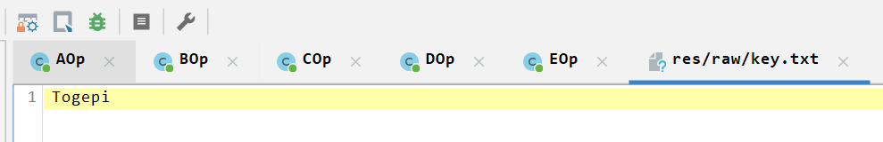

拿到key

+ 把 `"045e0c251301214e"` 当作 hex 转成字节数组 `cipher`；
+ 对每个字节做 `plain[i] = cipher[i] XOR key[i % keyLen]`；
+ 再把 `plain` 按 UTF-8 解码 → 明文字符串

<h4 id="pxAmT">exp:</h4>
```python
KEY_AOP = "Togepi".encode("utf-8")
ANSWER1_HEX = "045e0c251301214e"


def aop_encrypt(plain: str, key: bytes = KEY_AOP) -> str:
    """
    模拟 AOp.apply 的行为：
    1) UTF-8 编码
    2) 用 key 循环 XOR
    3) 输出小写十六进制字符串
    """
    data = plain.encode("utf-8")
    out = bytes([b ^ key[i % len(key)] for i, b in enumerate(data)])
    return out.hex()  # 小写 hex


def aop_decrypt(target_hex: str, key: bytes = KEY_AOP) -> str:
    """
    AOp 的逆向：
    1) hex -> bytes
    2) 用同样的 key 循环 XOR
    3) UTF-8 解码
    """
    cipher = bytes.fromhex(target_hex)
    plain_bytes = bytes([c ^ key[i % len(key)] for i, c in enumerate(cipher)])
    return plain_bytes.decode("utf-8")


if __name__ == "__main__":
    answer1 = aop_decrypt(ANSWER1_HEX, KEY_AOP)
    print("Badge 1 answer:", repr(answer1))

    # 校验一下正向是否一致
    reenc = aop_encrypt(answer1, KEY_AOP)
    print("Re-encoded via AOp:", reenc)
    print("Match:", reenc == ANSWER1_HEX)

```

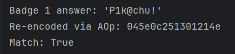

通关字符：

P1k@chu!

ps：都是leet形式的通关字符

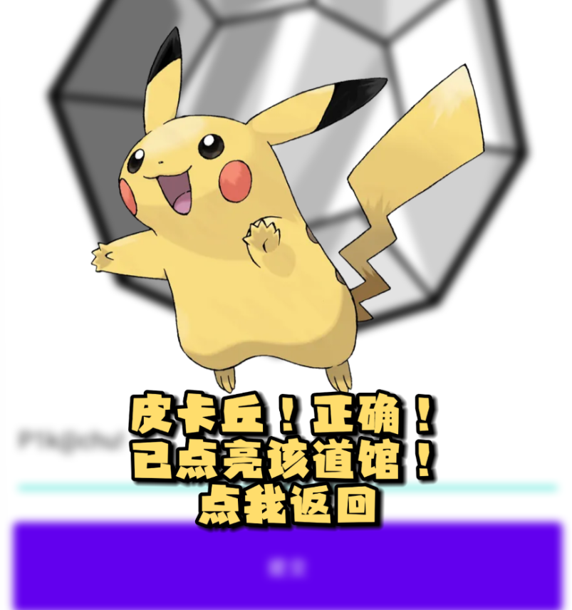


<h3 id="K5WYH">华蓝道馆 (BOp)</h3>
```plain
2, "华蓝道馆", Cr5aE0bqu\"
```


1. 把目标字符串整体反转（undo 最后的 `.reverse()`）；
2. 结果按 ASCII 编码成字节；
3. 这些字节转成大写 hex；
4. 对 hex 再调用一次 `reverseOddPositionsOneBased`（因为它是自反变换）；
5. 把结果 hex 解析成字节；
6. 按 UTF-8 解码成原始输入

<h4 id="BRHtc">exp:</h4>
```python
ANSWER2 = 'Cr5aE0bqu"'  # 注意最后是一个双引号字符


def to_hex_upper(bs: bytes) -> str:
    return ''.join(f"{b:02X}" for b in bs)


def reverse_odd_positions_one_based(s: str) -> str:
    # 对应 Java 的 reverseOddPositionsOneBased
    chars = list(s)
    # 收集 0,2,4,... 位置上的字符
    evens = [chars[i] for i in range(0, len(chars), 2)]
    idx = len(evens) - 1
    i = 0
    while i < len(chars):
        chars[i] = evens[idx]
        idx -= 1
        i += 2
    return ''.join(chars)


def bop_encrypt(plain: str) -> str:
    """
    模拟 BOp.apply：
    plain -> UTF8 bytes -> HEX_UPPER
          -> reverseOddPositionsOneBased
          -> hexToBytes -> ASCII string -> reverse
    """
    b = plain.encode("utf-8")
    hex_upper = to_hex_upper(b)
    h2 = reverse_odd_positions_one_based(hex_upper)
    b2 = bytes.fromhex(h2)
    s2 = b2.decode("ascii")
    return s2[::-1]


def bop_decrypt(target: str) -> str:
    """
    BOp 的逆向：
    target = BOp(plain)
    1) 先整体反转
    2) 当作 ASCII bytes
    3) 转成 HEX_UPPER
    4) 再跑一次 reverseOddPositionsOneBased（自反）
    5) hex -> bytes
    6) UTF-8 解码
    """
    s1 = target[::-1]
    b1 = s1.encode("ascii")
    hex1 = b1.hex().upper()
    h2 = reverse_odd_positions_one_based(hex1)
    b2 = bytes.fromhex(h2)
    return b2.decode("utf-8")


if __name__ == "__main__":
    ans2 = bop_decrypt(ANSWER2)
    print("Badge 2 answer:", repr(ans2))

    # 验证正向
    reenc = bop_encrypt(ans2)
    print("Re-encoded via BOp:", reenc)
    print("Match:", reenc == ANSWER2)
```

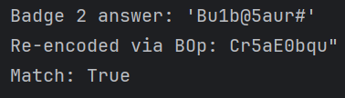

通关字符：

Bu1b@5aur#

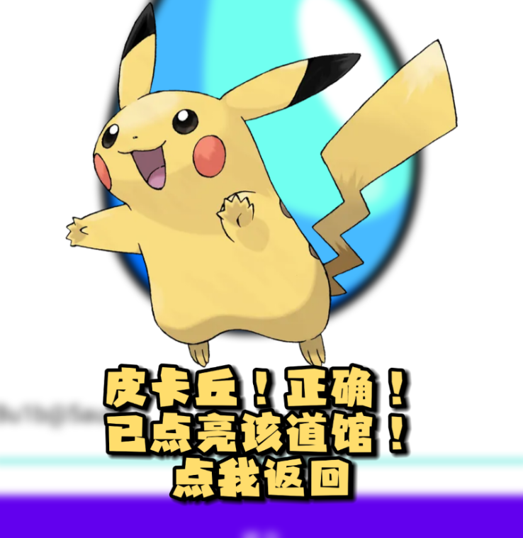

<h3 id="tuiwA">枯叶道馆 (COp)</h3>
```c
3, "枯叶道馆", 01850468411918C2358D31BE
```

+ 去掉输出末尾 2 字节 checksum；
+ 剩下正文整体反转（我们刚刚用索引推导证明，拆分/反转/交织 = 完全反转）；
+ 把 hex 串转成中间字节数组；
+ 对每个字节按位置做循环右移，逆转原来的 `ROL`；
+ 再和 `"Psyduck"` 做一次 XOR，逆转原来的 XOR；
+ 得到原始 UTF-8 字节，再 decode 成字符串

<h4 id="ofLg3">exp:</h4>
```python
# solve_badge3_cop.py
KEY = b"Psyduck"  # res/raw/key2.txt 的内容
ANSWER3 = "01850468411918C2358D31BE"  # BadgeRepository 中第三关的 answerHash


def ror8(x: int, r: int) -> int:
    """8 位循环右移 r 位"""
    r &= 7
    if r == 0:
        return x & 0xFF
    return ((x >> r) | ((x << (8 - r)) & 0xFF)) & 0xFF


def cop_decrypt_cop_style(out_str: str, key: bytes) -> bytes:
    """
    逆向 COp.nativeProcess：
    - out_str = Body(重排后的 hex 串) + 2 字节 checksum 头（sub_21B30("%02X", v55)）
    - Body = reverse(原始 hex 串)，对于 hex 长度为偶数成立
    - 原始 hex 串是 XOR+ROL 后的字节编码
    """
    out_str = out_str.strip()
    if len(out_str) < 4 or len(out_str) % 2 != 0:
        raise ValueError(f"unexpected output length: {len(out_str)}")

    # 1. 去掉末尾 2 字节 checksum
    body = out_str[:-2]         # 剩下正文部分
    # 2. 正文整体反转，得到原始 hex 串
    hex_str = body[::-1]

    # 3. hex -> bytes（这是 XOR + 旋转之后的中间字节）
    data = bytearray.fromhex(hex_str)

    # 4. 逆旋转：
    #    正向：r_i = (i * 3) & 7，若 r_i != 0 则 s[i] = ROL8(s[i], r_i)
    #    逆向：若 r_i != 0 则 s[i] = ROR8(s[i], r_i)
    for i in range(len(data)):
        r = (i * 3) % 8
        if r != 0:
            data[i] = ror8(data[i], r)

    # 5. 逆 XOR：正向是 s[i] ^= key[i % key_len]，逆向再 XOR 一次即可
    key_len = len(key)
    plain = bytearray(len(data))
    for i, b in enumerate(data):
        plain[i] = b ^ key[i % key_len]

    return bytes(plain)


if __name__ == "__main__":
    plain_bytes = cop_decrypt_cop_style(ANSWER3, KEY)

    try:
        plain_str = plain_bytes.decode("utf-8")
    except UnicodeDecodeError:
        plain_str = None

    print("Badge 3 raw bytes:", plain_bytes)
    if plain_str is not None:
        print("Badge 3 answer (UTF-8):", repr(plain_str))
    else:
        print("Badge 3 answer is not valid UTF-8, hex =",
              plain_bytes.hex().upper())
```

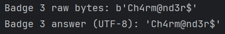

通关字符：

Ch4rm@nd3r$

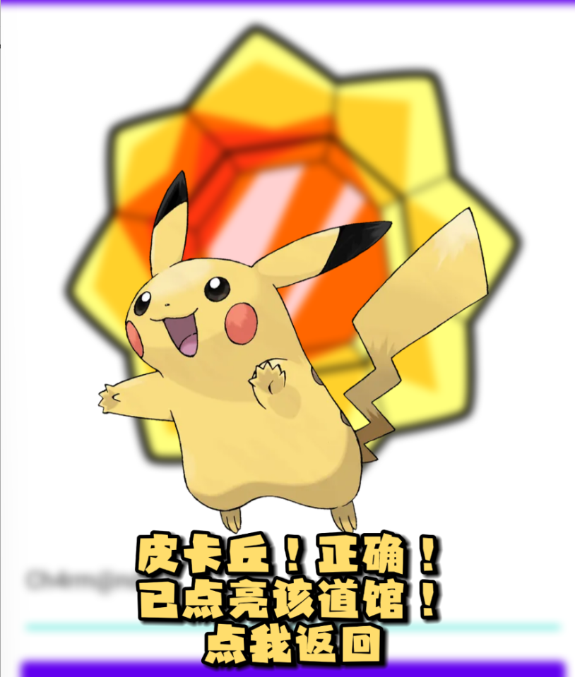

<h3 id="mnp4P">金黄道馆（DOp）</h3>
```c
4, "金黄道馆", C44805F320117A596D6AE7B88B73CF0A
```

key和iv前面在so层已经拿到了

```c
key：
4F 42 5D 08 56 27 51 03 74 11 48 6F 41 52 35 4E

iv:
1A 22 01 72 30 0C 26 35 0D 17 10 69 21 3B 04 6D
```

<h4 id="jDWgw">exp:</h4>
```python
# decode_dop_badge4.py
from Crypto.Cipher import AES

ANSWER4 = "C44805F320117A596D6AE7B88B73CF0A"


# --------- 工具函数 ---------
def u64_to_bytes_le(x: int) -> bytes:
    """64 位整数小端序转 8 字节"""
    return x.to_bytes(8, byteorder="little")


def u64_to_bytes_be(x: int) -> bytes:
    """64 位整数大端序转 8 字节"""
    return x.to_bytes(8, byteorder="big")


def pkcs7_unpad(data: bytes, block_size: int = 16) -> bytes:
    if not data:
        raise ValueError("empty data")
    pad_len = data[-1]
    if pad_len <= 0 or pad_len > block_size:
        raise ValueError(f"invalid pad length {pad_len}")
    if data[-pad_len:] != bytes([pad_len]) * pad_len:
        raise ValueError("invalid padding bytes")
    return data[:-pad_len]


# --------- 从 so 常量生成所有候选 key/iv ---------

# 常量抄自 nativeGetKey/nativeGetIv
K_W1 = 0x03512756085D424F
K_W2 = 0x4E3552416F481174

IV_W1 = 0x35260C307201221A
IV_W2 = 0x6D043B216910170D

# 生成 4 种 key 方案（大小端 + w1/w2 拼接顺序）
def gen_key_candidates():
    w1_le = u64_to_bytes_le(K_W1)
    w2_le = u64_to_bytes_le(K_W2)
    w1_be = u64_to_bytes_be(K_W1)
    w2_be = u64_to_bytes_be(K_W2)

    # 小端拼接两种顺序
    yield ("key_le_w1w2", w1_le + w2_le)
    yield ("key_le_w2w1", w2_le + w1_le)

    # 大端拼接两种顺序
    yield ("key_be_w1w2", w1_be + w2_be)
    yield ("key_be_w2w1", w2_be + w1_be)


# 生成 4 种 IV 方案
def gen_iv_candidates():
    w1_le = u64_to_bytes_le(IV_W1)
    w2_le = u64_to_bytes_le(IV_W2)
    w1_be = u64_to_bytes_be(IV_W1)
    w2_be = u64_to_bytes_be(IV_W2)

    yield ("iv_le_w1w2", w1_le + w2_le)
    yield ("iv_le_w2w1", w2_le + w1_le)

    yield ("iv_be_w1w2", w1_be + w2_be)
    yield ("iv_be_w2w1", w2_be + w1_be)


# --------- 尝试所有组合解密 ---------
def try_all_combinations(answer_hex: str):
    cipher_bytes = bytes.fromhex(answer_hex)

    results = []

    for k_name, key in gen_key_candidates():
        for iv_name, iv in gen_iv_candidates():
            combo_name = f"{k_name} + {iv_name}"
            try:
                cipher = AES.new(key, AES.MODE_CBC, iv)
                padded = cipher.decrypt(cipher_bytes)
                plain = pkcs7_unpad(padded)

                # 尝试 UTF-8 解码
                try:
                    s = plain.decode("utf-8")
                    printable = True
                except UnicodeDecodeError:
                    s = plain.hex().upper()
                    printable = False

                results.append((combo_name, plain, s, printable))

            except Exception as e:
                # padding 错误或其他异常，忽略
                continue

    return results


if __name__ == "__main__":
    candidates = try_all_combinations(ANSWER4)

    if not candidates:
        print("没有任何组合解出合法的 PKCS7 明文，请检查常量。")
    else:
        print("可能的解密结果（只列出 UTF-8 解码成功的）：\n")
        for name, raw, s, printable in candidates:
            if printable:
                print("=== 组合:", name, "===")
                print("raw bytes:", raw)
                print("string   :", repr(s))
                print()
        print("\n若上边只有一个看着像宝可梦名字的，那就是这关的答案。")

```

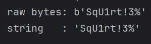

通关字符

SqU1rt!3%

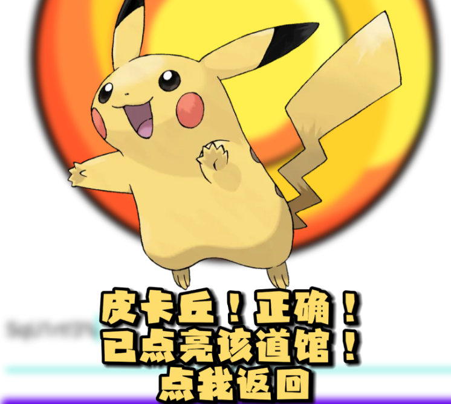

<h3 id="GtsHe">玉虹道馆（EOp）</h3>
```c
5, "玉虹道馆", 050237671445B5169675F7
```

key1由KEY_P1 / KEY_P2 异或出来

+ KEY1_P1 = [115, 8, 90, 16, 48, 72, -18, 17]
+ KEY1_P2 = [16, 63, 39, 114, 15, 51, -86, 65]

逐位XOR 得到key1（十进制）

```c
[99, 55, 125, 98, 63, 123, 68, 80]
```

十六进制

```c
63 37 7D 62 3F 7B 44 50
```


key2在so层已经拿到

大小端序都尝试

```c
大端：
64 55 56 55 53 56 51 73
小端：
73 51 56 53 55 56 55 64
```

<h4 id="tTok4">exp:</h4>
```python
# eop_decrypt_full.py
from typing import List

# --- key1：由 KEY1_P1 / KEY1_P2 异或得到 ---
# KEY1_P1 = [115, 8, 90, 16, 48, 72, -18, 17]
# KEY1_P2 = [16, 63, 39, 114, 15, 51, -86, 65]
# 逐位 ^ 之后：
# [99, 55, 125, 98, 63, 123, 68, 80]  ->  0x63 0x37 0x7D 0x62 0x3F 0x7B 0x44 0x50
KEY1 = bytes([0x63, 0x37, 0x7D, 0x62, 0x3F, 0x7B, 0x44, 0x50])


# --- key2：来自 nativeGetKey2 ---
# v3[0] = 0x6455565553565173LL;  // 64 位常量，小端内存布局
# 解析成两种可能，优先试 LE：
KEY2_LE = bytes.fromhex("7351565355565564")  # 小端：73 51 56 53 55 56 55 64
KEY2_BE = bytes.fromhex("6455565553565173")  # 大端：64 55 56 55 53 56 51 73


def inverse_interleave_odd_even(mixed: str) -> str:
    """
    反向 interleaveOddEven：
    正向：H -> 拆偶/奇 -> 反转 -> 交替合并成 M
    这里：M -> 拆回 E_rev/O_rev -> 反转回 E/O -> 按偶/奇位复原 H
    """
    L = len(mixed)
    lenE = (L + 1) // 2   # 原串偶数位个数
    lenO = L // 2         # 原串奇数位个数

    # 先按 forward 时的交替规则从 mixed 中拆回 E_rev / O_rev
    E_rev: List[str] = []
    O_rev: List[str] = []
    idx = 0
    while idx < L:
        if len(E_rev) < lenE:
            E_rev.append(mixed[idx])
            idx += 1
        if len(O_rev) < lenO and idx < L:
            O_rev.append(mixed[idx])
            idx += 1

    # 反转回原来的 E / O
    E = E_rev[::-1]
    O = O_rev[::-1]

    # 按原来偶/奇位置重建 H
    chars = [""] * L
    ei = oi = 0
    for pos in range(L):
        if pos % 2 == 0:
            chars[pos] = E[ei]
            ei += 1
        else:
            chars[pos] = O[oi]
            oi += 1

    return "".join(chars)


def eop_decrypt_with_key(eop_output: str, key2: bytes) -> bytes:
    """
    逆向 EOp.apply，给定一个 key2。
    返回：原始明文字节（UTF-8）
    """
    out = eop_output.strip()

    # 1. 逆最后的整体 reverse
    mid = out[::-1]

    # 2. 逆 interleaveOddEven
    hex_str = inverse_interleave_odd_even(mid)

    # 3. HEX -> bytes3（第二次 XOR 之后的 bytes）
    data3 = bytearray.fromhex(hex_str)

    # 4. 逆第二次 XOR (key2)
    data2 = bytearray(len(data3))
    for i, b in enumerate(data3):
        data2[i] = b ^ key2[i % len(key2)]

    # 5. 逆 reverseBytes
    data1 = bytearray(reversed(data2))

    # 6. 逆第一次 XOR (key1)
    data0 = bytearray(len(data1))
    for i, b in enumerate(data1):
        data0[i] = b ^ KEY1[i % len(KEY1)]

    return bytes(data0)


def eop_try_both(eop_output: str):
    """
    同时尝试 LE / BE 两种 key2，方便你确认哪种是正确的。
    """
    candidates = []
    for name, k2 in [("KEY2_LE", KEY2_LE), ("KEY2_BE", KEY2_BE)]:
        try:
            plain = eop_decrypt_with_key(eop_output, k2)
            try:
                s = plain.decode("utf-8")
                dec_ok = True
            except UnicodeDecodeError:
                s = plain.hex().upper()
                dec_ok = False
            candidates.append((name, plain, s, dec_ok))
        except Exception as e:
            # 这里基本不会异常，除非 hex/长度有问题
            continue
    return candidates


if __name__ == "__main__":
    ANSWER5 = "050237671445B5169675F7"

    res = eop_try_both(ANSWER5)

    for name, raw, s, dec_ok in res:
        print("=== 尝试 key2 =", name, "===")
        print("raw bytes:", raw)
        if dec_ok:
            print("UTF-8:", repr(s))
        else:
            print("not UTF-8, hex =", s)
        print()
```

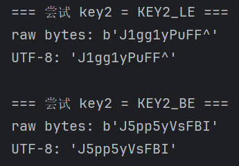

小端序过了

通关字符：

J1gg1yPuFF^

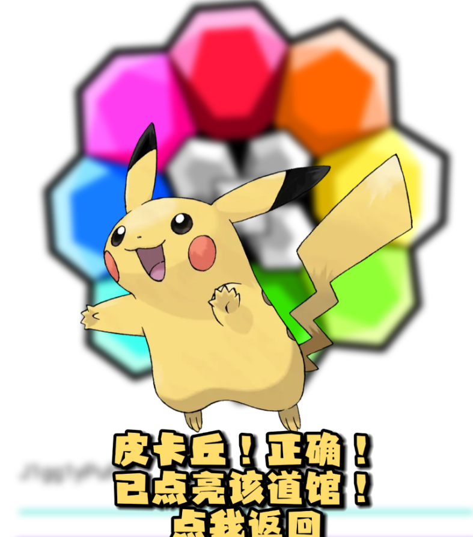

<h3 id="ZONZP">浅红道馆（AOp+BOp+COp）</h3>
```c
6, "浅红道馆", 24D8F250A275A414C6D692476031236636
```

前面已经有逆的脚本了，整合一下

<h4 id="zA3JP">exp:</h4>
```c
# solve_badge6.py
def ror8(x, r):
    r &= 7
    if r == 0:
        return x & 0xFF
    return ((x >> r) | ((x << (8 - r)) & 0xFF)) & 0xFF


def cop_decrypt(out_str: str, key: bytes) -> bytes:
    out_str = out_str.strip()
    if len(out_str) < 4 or len(out_str) % 2 != 0:
        raise ValueError(f"unexpected len {len(out_str)}")
    # COp: body + 2-char checksum 后缀
    body = out_str[:-2]
    hex_str = body[::-1]                 # 逆重排：等价整体 reverse
    data = bytearray.fromhex(hex_str)
    # 逆 bit 旋转
    for i in range(len(data)):
        r = (i * 3) % 8
        if r != 0:
            data[i] = ror8(data[i], r)
    # 逆 XOR
    res = bytearray(len(data))
    for i, b in enumerate(data):
        res[i] = b ^ key[i % len(key)]
    return bytes(res)


def reverse_odd_positions_one_based(s: str) -> str:
    chars = list(s)
    evens = [chars[i] for i in range(0, len(chars), 2)]
    evens_rev = evens[::-1]
    idx = 0
    for i in range(0, len(chars), 2):
        chars[i] = evens_rev[idx]
        idx += 1
    return "".join(chars)


def bop_decrypt(out_str: str) -> bytes:
    # out_str = BOp.apply 的返回值
    str2 = out_str[::-1]
    bytes2 = str2.encode('ascii')
    hex2 = bytes2.hex().upper()
    hex1 = reverse_odd_positions_one_based(hex2)
    data = bytes.fromhex(hex1)
    return data


def aop_decrypt_hex(hex_str: str, key: bytes) -> bytes:
    data = bytearray.fromhex(hex_str)
    res = bytearray(len(data))
    for i, b in enumerate(data):
        res[i] = b ^ key[i % len(key)]
    return bytes(res)


if __name__ == "__main__":
    # Badge 6 的 answerHash：
    badge6_hash = "24D8F250A275A414C6D692476031236636"

    # 1) 先逆 COp（key = "Psyduck"）
    after_cop = cop_decrypt(badge6_hash, b"Psyduck")
    print("After COp^-1:", after_cop)  # 应该是 ASCII 字符串

    # 2) 逆 BOp，得到 AOp 的 hex 输出
    stage1_bytes = bop_decrypt(after_cop.decode('utf-8'))
    print("After BOp^-1 (hex string):", stage1_bytes.decode('utf-8'))

    # 3) 逆 AOp（key = "Togepi"），得到原始 UTF-8 明文
    plain_bytes = aop_decrypt_hex(stage1_bytes.decode('utf-8'), b"Togepi")
    print("Plain bytes:", plain_bytes)
    print("Plain text:", plain_bytes.decode('utf-8'))
```

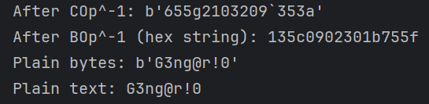

通关字符：

G3ng@r!0

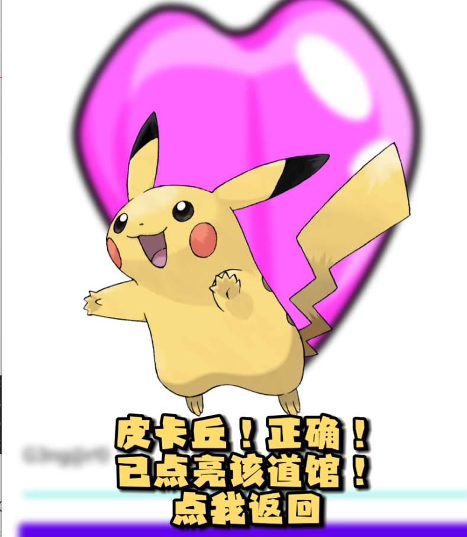

<h3 id="XWTCY">红莲道馆（BOp+COp+DOp）</h3>
```c
7, "红莲道馆", 07337BE63BB7975B1183D3E71173989C
```

<h4 id="gfFpE">exp:</h4>
```python
# solve_badge7_simple.py
from Crypto.Cipher import AES

ANSWER7 = "07337BE63BB7975B1183D3E71173989C"  # Badge 7 answerHash

# ----- DOp^-1 -----
KEY = bytes.fromhex("4F425D08562751037411486F4152354E")
IV  = bytes.fromhex("1A220172300C26350D171069213B046D")

def dop_decrypt(cipher_hex: str) -> bytes:
    ct = bytes.fromhex(cipher_hex)
    cipher = AES.new(KEY, AES.MODE_CBC, IV)
    padded = cipher.decrypt(ct)
    pad_len = padded[-1]
    return padded[:-pad_len]   # 去掉 PKCS7 padding


# ----- COp^-1 -----
def ror8(x, r):
    r &= 7
    if r == 0:
        return x & 0xFF
    return ((x >> r) | ((x << (8 - r)) & 0xFF)) & 0xFF

def cop_decrypt(out_str: str, key: bytes) -> bytes:
    out_str = out_str.strip()
    body = out_str[:-2]              # 去掉末尾 2 字节校验
    hex_str = body[::-1]             # 正文整体反转

    data = bytearray.fromhex(hex_str)

    for i in range(len(data)):
        r = (i * 3) % 8
        if r != 0:
            data[i] = ror8(data[i], r)

    res = bytearray(len(data))
    for i, b in enumerate(data):
        res[i] = b ^ key[i % len(key)]
    return bytes(res)


# ----- BOp^-1 -----
def reverse_odd_positions_one_based(s: str) -> str:
    chars = list(s)
    evens = [chars[i] for i in range(0, len(chars), 2)]
    evens_rev = evens[::-1]
    idx = 0
    for i in range(0, len(chars), 2):
        chars[i] = evens_rev[idx]
        idx += 1
    return "".join(chars)

def bop_decrypt(out_str: str) -> bytes:
    s2 = out_str[::-1]
    b2 = s2.encode('ascii')
    hex2 = b2.hex().upper()
    hex1 = reverse_odd_positions_one_based(hex2)
    return bytes.fromhex(hex1)


if __name__ == "__main__":
    # 1) DOp^-1：把 AES/CBC/PKCS5 + HEX 还原成 COp 输出串
    after_dop = dop_decrypt(ANSWER7).decode('utf-8')
    print("After DOp^-1 (COp output):", after_dop)

    # 2) COp^-1：key = "Psyduck"
    after_cop = cop_decrypt(after_dop, b"Psyduck")
    print("After COp^-1 (BOp output):", after_cop)

    # 3) BOp^-1：UTF-8 原文
    plain_bytes = bop_decrypt(after_cop.decode('utf-8'))
    print("Plain bytes:", plain_bytes)
    print("Plain text :", plain_bytes.decode('utf-8'))

```

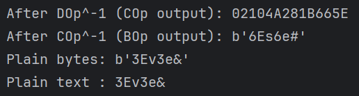

通关字符：

3Ev3e&

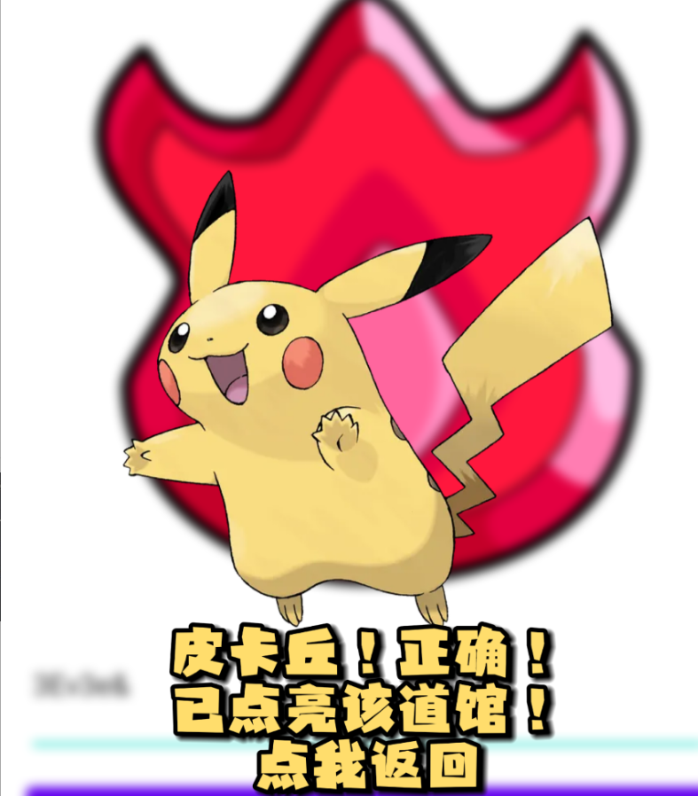

<h3 id="wT8VU">常青道馆（COp+DOp+EOp）</h3>
```c
8, "常青道馆", 6115F65510916254717581C527D67233510281B570F175542165A19270965523162251D270F605647112E68227B11223B172B1A540E14264B142F645279125F3
```

<h4 id="kuodf">exp:</h4>
```python
from typing import List
from Crypto.Cipher import AES

ANSWER8 = ("6115F65510916254717581C527D67233510281B570F1755"
           "42165A19270965523162251D270F605647112E68227B1122"
           "3B172B1A540E14264B142F645279125F3")

# ---------- EOp 相关：key1 / key2（已确认是小端） ----------

KEY1 = bytes([0x63, 0x37, 0x7D, 0x62, 0x3F, 0x7B, 0x44, 0x50])   # buildKey1()
KEY2 = bytes.fromhex("7351565355565564")                         # nativeGetKey2 小端

def inverse_interleave_odd_even(mixed: str) -> str:
    L = len(mixed)
    lenE = (L + 1) // 2
    lenO = L // 2
    E_rev: List[str] = []
    O_rev: List[str] = []
    idx = 0
    while idx < L:
        if len(E_rev) < lenE:
            E_rev.append(mixed[idx]); idx += 1
        if len(O_rev) < lenO and idx < L:
            O_rev.append(mixed[idx]); idx += 1
    E = E_rev[::-1]
    O = O_rev[::-1]
    chars = [""] * L
    ei = oi = 0
    for pos in range(L):
        if pos % 2 == 0:
            chars[pos] = E[ei]; ei += 1
        else:
            chars[pos] = O[oi]; oi += 1
    return "".join(chars)

def eop_decrypt(eop_output: str) -> bytes:
    out = eop_output.strip()
    mid = out[::-1]
    hex_str = inverse_interleave_odd_even(mid)
    data3 = bytearray.fromhex(hex_str)
    # 逆第二次 XOR (key2)
    data2 = bytearray(len(data3))
    for i, b in enumerate(data3):
        data2[i] = b ^ KEY2[i % len(KEY2)]
    # 逆 reverseBytes
    data1 = bytearray(reversed(data2))
    # 逆第一次 XOR (key1)
    data0 = bytearray(len(data1))
    for i, b in enumerate(data1):
        data0[i] = b ^ KEY1[i % len(KEY1)]
    return bytes(data0)  # 这是 DOp 的输出字符串（UTF-8）


# ---------- DOp^-1：AES/CBC/PKCS7 + HEX ----------

KEY_D = bytes.fromhex("4F425D08562751037411486F4152354E")
IV_D  = bytes.fromhex("1A220172300C26350D171069213B046D")

def dop_decrypt(cipher_hex: str) -> bytes:
    ct = bytes.fromhex(cipher_hex)
    cipher = AES.new(KEY_D, AES.MODE_CBC, IV_D)
    padded = cipher.decrypt(ct)
    pad_len = padded[-1]
    return padded[:-pad_len]  # COp 的输出字符串（UTF-8 bytes）


# ---------- COp^-1 ----------

def ror8(x, r):
    r &= 7
    if r == 0:
        return x & 0xFF
    return ((x >> r) | ((x << (8 - r)) & 0xFF)) & 0xFF

def cop_decrypt(out_str: str, key: bytes) -> bytes:
    out_str = out_str.strip()
    body = out_str[:-2]        # 去掉末尾 2 字节校验
    hex_str = body[::-1]       # 正文整体反转
    data = bytearray.fromhex(hex_str)
    for i in range(len(data)):
        r = (i * 3) % 8
        if r != 0:
            data[i] = ror8(data[i], r)
    res = bytearray(len(data))
    for i, b in enumerate(data):
        res[i] = b ^ key[i % len(key)]
    return bytes(res)          # 原始明文字节（UTF-8）


# ---------- 主流程 ----------

if __name__ == "__main__":
    # 1) EOp^-1
    dop_out_bytes = eop_decrypt(ANSWER8)
    dop_out_str = dop_out_bytes.decode("utf-8")
    print("After EOp^-1 (DOp 输出串):", dop_out_str)

    # 2) DOp^-1
    cop_out_bytes = dop_decrypt(dop_out_str)
    cop_out_str = cop_out_bytes.decode("utf-8")
    print("After DOp^-1 (COp 输出串):", cop_out_str)

    # 3) COp^-1（key = "Psyduck"）
    plain_bytes = cop_decrypt(cop_out_str, b"Psyduck")
    print("Plain bytes:", plain_bytes)
    print("Plain text :", plain_bytes.decode("utf-8"))

```

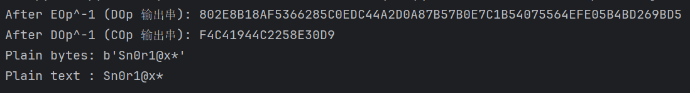

通关字符：

 Sn0r1@x*

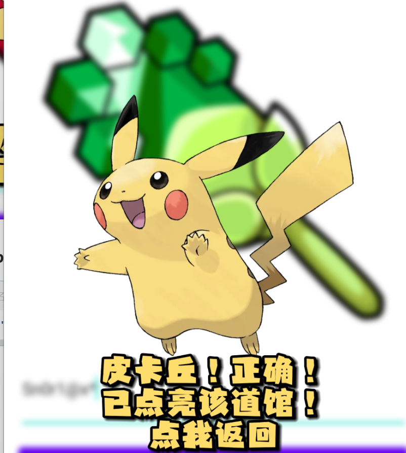

<h3 id="P7hTy">终极试炼</h3>
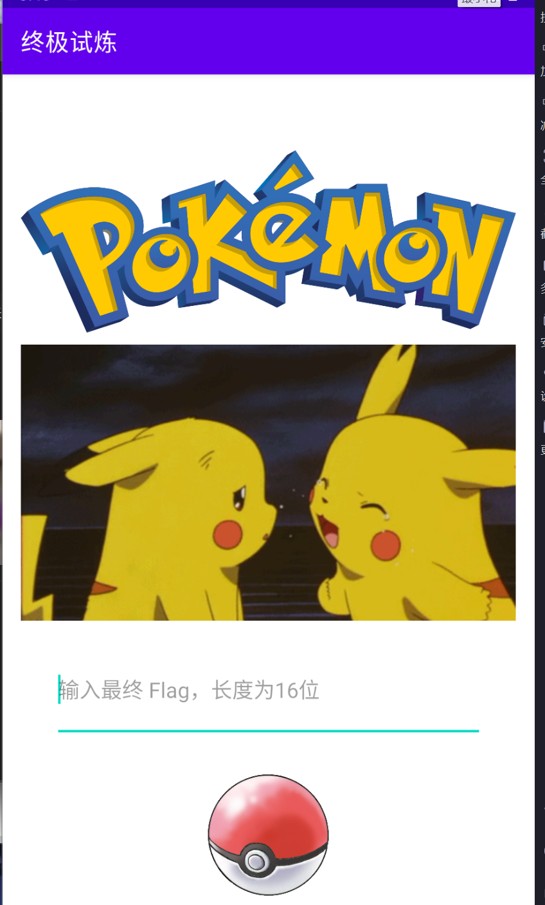

每个道馆通关字符：

```plain
P1k@chu!
Bu1b@5aur#
Ch4rm@nd3r$
SqU1rt!3%
J1gg1yPuFF^
G3ng@r!0
3Ev3e&
Sn0r1@x*
```

```python
0x15848  "Third, sixth；"
0x14984  "Fourth, tenth；"
0x157DE  "Fourth, ninth；"
0x152A7  "Second, fourth；"
0x14BAB  "Third, seventh；"
0x14ED3  "First, third；"
0x14EE3  "Third, fourth；"
0x1587A  "First, eighth "
```

按位取值：

```python
1: kh
2: b#
3: r3
4: q1
5: gP
6: Gn
7: v3
8: S*
```

通关字符： 

khb#r3q1gPGnv3S*

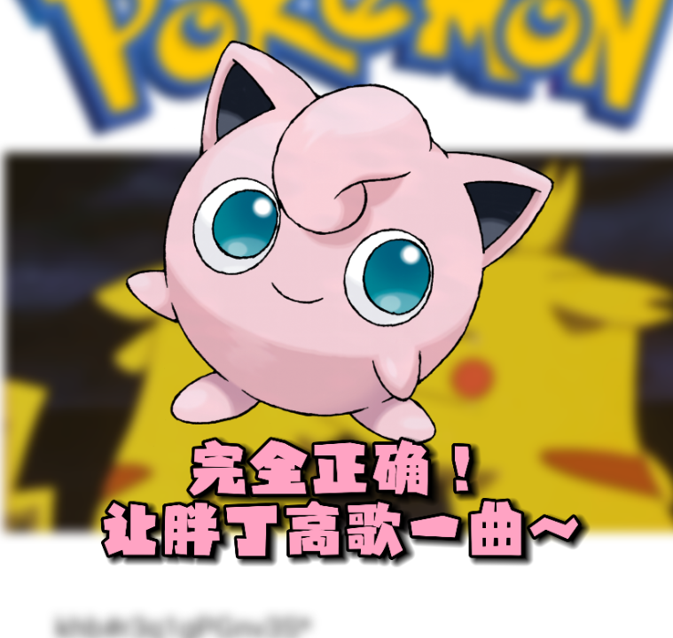

<h4 id="BSroL">flag:</h4>
 ISCC{khb#r3q1gPGnv3S*}

